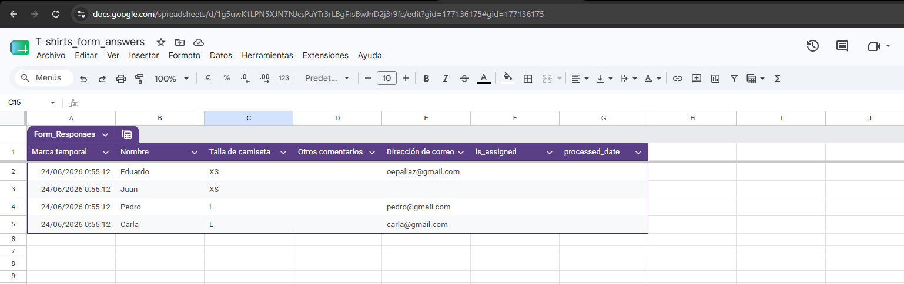
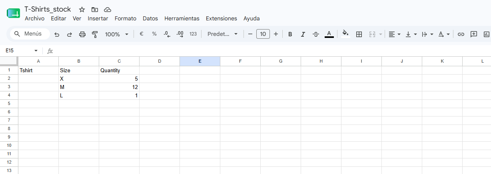
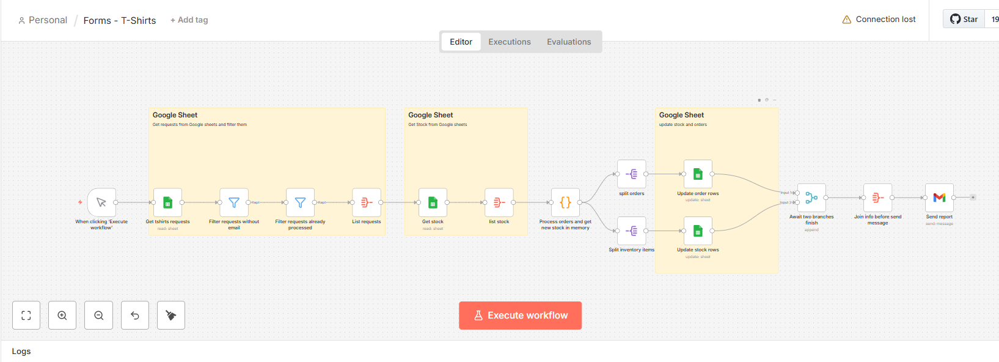
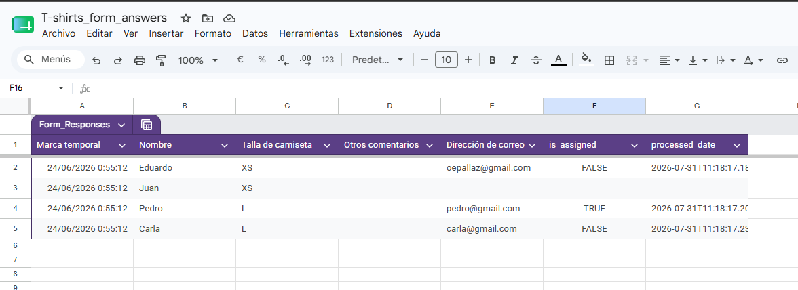
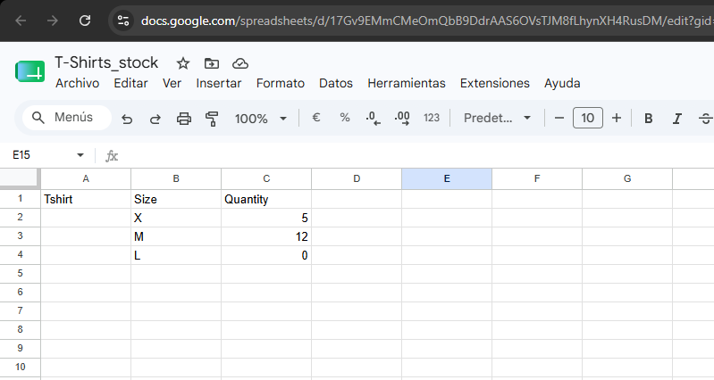
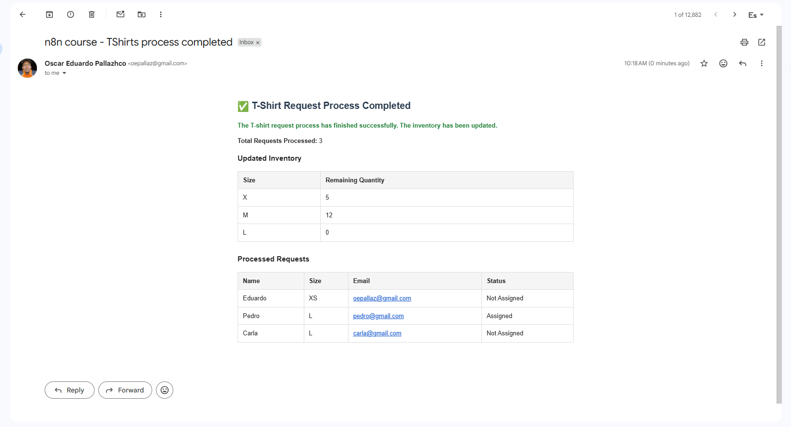

# T-shirts Forms Workflow

The workflow created here does the following:

- Retrieves T-shirt requests from a spreadsheet that has been preconfigured using Google Forms
- Discard any requests that, for whatever reason, do not have an email address assigned to them, as well as those that have already been processed.
- Retrieve the current T-shirt inventory located on another sheet
- Processes requests locally; if the item is out of stock or the T-shirt is not available, it is marked as “not assigned”; otherwise, it is marked as “assigned,” and a new stock entry is temporarily created.
- Update:
    1. The requests sheet to indicate whether or not they were assigned and the processing date
    2. The inventory sheet with updates to available quantities
- Send a report via email detailing the processed requests and the current inventory

## Topics

- Filters and Validations
- Code Node
- Split Flow into Multiple Paths
- Merge Flows and Wait for Responses
- Google Sheets Triggers

## Screenshots

---
---

---
---

---
---

---
---

---
---

---
---

