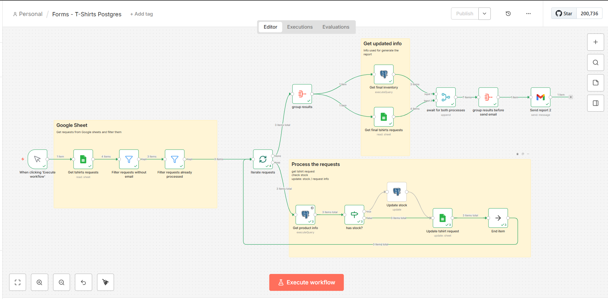
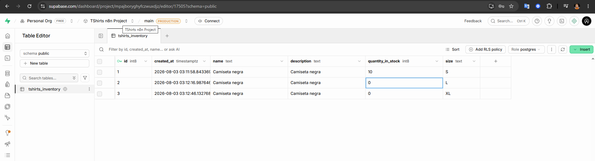
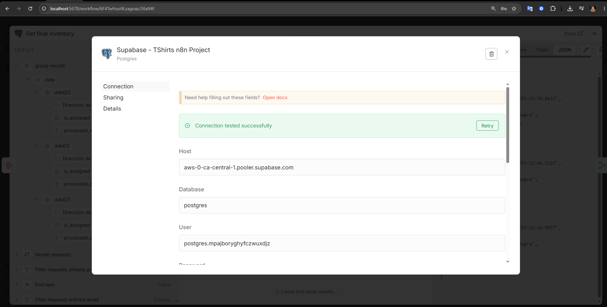
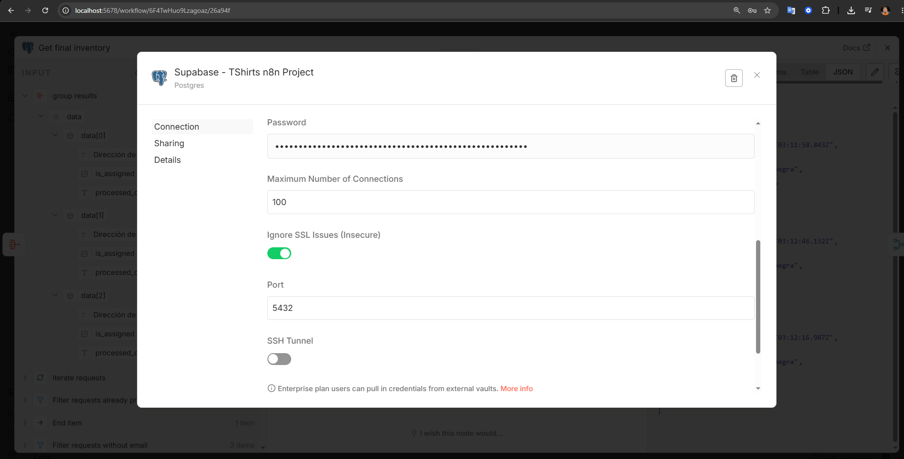

# T-shirts Forms Workflow, using postgres db

The workflow created here does the following:

- Retrieves T-shirt requests from a spreadsheet that has been preconfigured using Google Forms
- Discard any requests that, for whatever reason, do not have an email address assigned to them, as well as those that have already been processed.
- Iterate the valid tshirt requests and for each:
    1. Retrieve product info from the DB
    2. Check the stock
    3. if has stock update the record in the DB with the new stock
    4. Regardless of whether or not there is stock available, update the request information: the processing date, and whether or not it was assigned
- Retrieve T-shirt requests from the spreadsheet again for get the process info
- Retrieve products info from the DB with the updated stocks
- Send a report via email detailing the processed requests and the current inventory

## Topics

- Supabase
- Loop | If | Edit | PostgreSQL Nodes

## Screenshots

---
---

---
---

---
---

