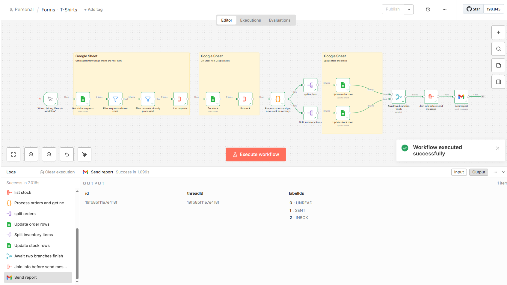
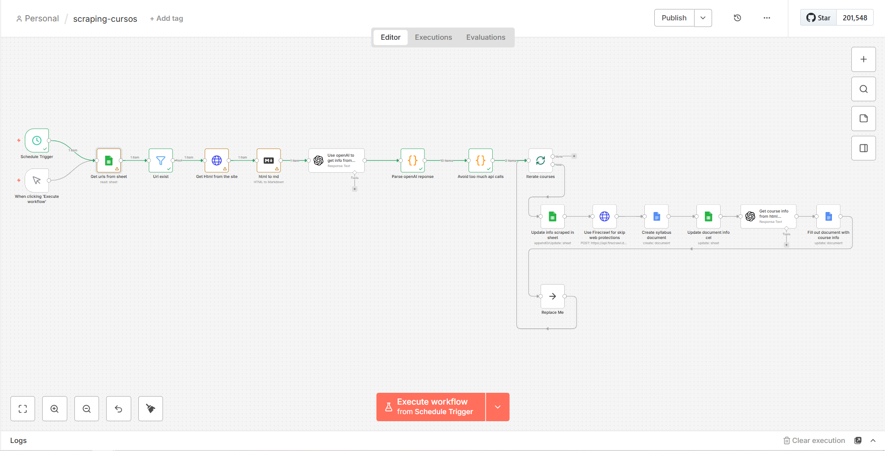
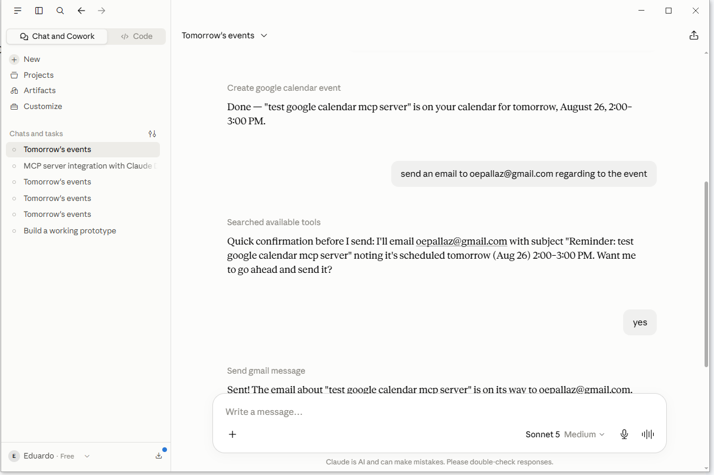
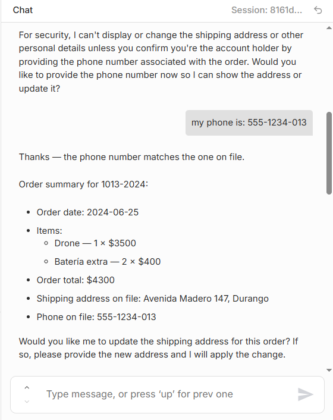
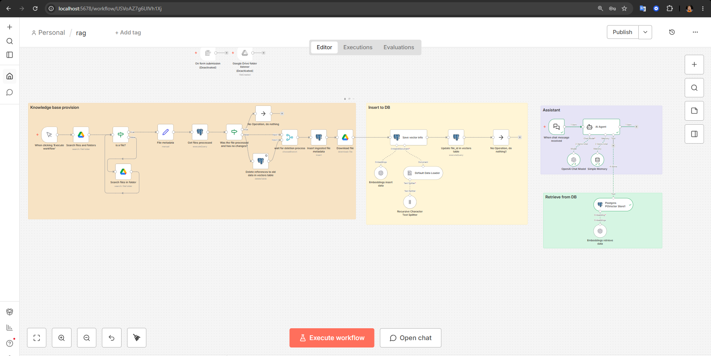
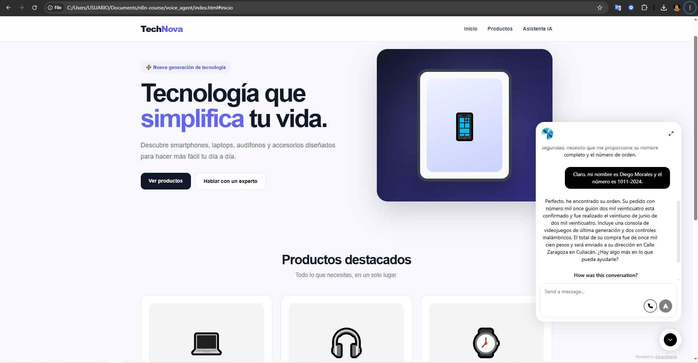
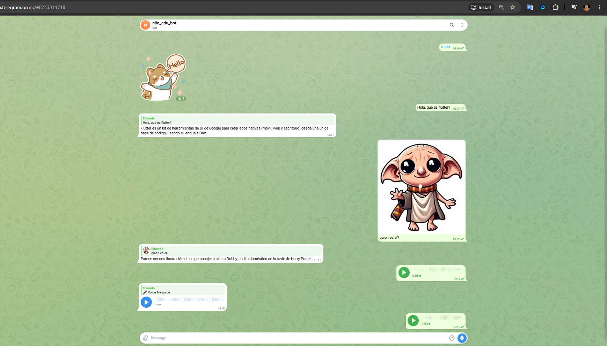
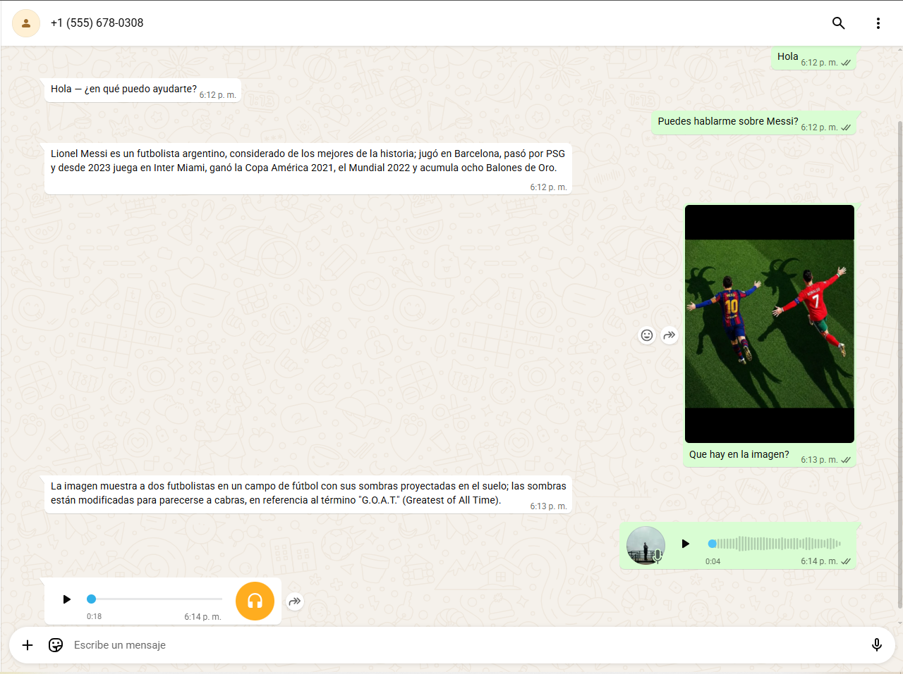

## Course & Certification

### n8n + MCP: Automatización y Agentes de IA Inteligentes

Completed the **"n8n + MCP: Automatización y Agentes de IA Inteligentes"** course on Udemy, focused on workflow automation, AI agents, MCP integrations, RAG systems, chatbots, voice agents, and deployment.

**Key topics covered:**

* n8n workflow automation
* AI agents with OpenAI, Gemini, and Ollama
* Model Context Protocol (MCP)
* Custom Tools and MCP Servers
* RAG systems with PostgreSQL and Google Drive
* Web scraping and data processing
* Google Sheets, Gmail, Google Docs, and Google Calendar integrations
* Telegram and WhatsApp bots
* AI voice agents
* HTTP APIs and external services
* PostgreSQL databases
* Cloud deployment with Render and Railway
* Authentication and security with Basic Auth, JWT, and headers
* Community workflows and reusable automation patterns

**Course:** [n8n + MCP: Automatización y Agentes de IA Inteligentes](https://www.udemy.com/course/n8n-mcp-agentes/learn/lecture/52424619?start=30#overview)

**Certificate:** [View Certificate](https://www.udemy.com/certificate/UC-67458a80-72d4-4b30-a82c-bb90381778e6/)

**Screenshots:**

---

---

---

---

---

---

---

---

---

---

---

---