# Personal Assistant Workflow

This n8n workflow demonstrates how to build a practical AI-powered personal assistant by combining an **AI Agent**, external tools, custom workflows, and **Model Context Protocol (MCP)** servers.

The assistant can interact with services such as **Google Calendar** and **Gmail**, retrieve information from Wikipedia, and use a custom Pokémon API tool. The Google Calendar and Gmail tools are also exposed through MCP servers, allowing the same capabilities to be reused by other MCP-compatible clients such as **Claude Desktop**.

## Overview

The workflow starts with a **chat interface** that allows users to interact with the personal assistant.

An **AI Agent** is connected to the chat interface and provided with:

* An OpenAI language model
* Simple chat memory
* Google Calendar tools
* Gmail tools
* Wikipedia
* A custom Pokémon Finder tool

With these tools available, the agent can do more than simply generate text. It can retrieve information and perform real actions on behalf of the user.

## AI Agent and Memory

The chatbot is connected to an **AI Agent** powered by an OpenAI model.

The agent also uses **Simple Memory** to maintain conversational context, allowing users to have multi-turn conversations without having to repeat information from previous messages.

The combination of the AI model, memory, and external tools allows the assistant to understand requests and determine which tool should be used to accomplish each task.

## External Tools

Several tools are connected directly to the AI Agent.

### Google Calendar

The Google Calendar tools allow the assistant to interact with the user's calendar and perform actions such as:

* Creating events
* Retrieving calendar information
* Updating events
* Deleting events

This allows users to manage their calendar using natural language through the chatbot.

### Gmail

The Gmail tools allow the assistant to interact with email and perform actions such as:

* Searching for emails
* Reading email information
* Sending emails
* Managing messages

This gives the assistant the ability to perform common email-related tasks on behalf of the user.

### Wikipedia

Wikipedia is also available as an external tool, allowing the agent to retrieve additional information when answering questions that benefit from an external knowledge source.

## Custom Pokémon Finder Tool

The workflow also demonstrates how to create a **custom AI tool** based on another workflow.

A custom **Pokémon Finder** tool was created to allow the assistant to query the Pokémon API and retrieve information about Pokémon.

This demonstrates an important pattern in n8n: an existing workflow can be turned into a reusable tool that an AI Agent can invoke when appropriate.

For example, a user could ask the assistant for information about a specific Pokémon, and the agent can determine that the Pokémon Finder tool is the appropriate resource to answer the request.

## Sub-Workflows

The workflow introduces the concept of **sub-workflows**—smaller workflows that can be called and reused by other workflows.

This approach makes complex automations easier to organize and maintain.

In this project, sub-workflows are particularly useful for building reusable tools that can be exposed to the AI Agent or other systems.

## MCP Servers

One of the main concepts demonstrated in this workflow is the use of **Model Context Protocol (MCP)**.

The Google Calendar tools are grouped together and exposed through an MCP Server. This allows the same set of tools to be reused by applications other than the original n8n AI Agent.

The Gmail tools are similarly grouped into their own MCP Server.

This creates a reusable architecture where n8n acts not only as an AI automation platform but also as a provider of tools that can be consumed by other MCP-compatible applications.

### Google Calendar MCP Server

The Google Calendar operations are exposed through an MCP Server, allowing external MCP clients to access the same calendar capabilities.

### Gmail MCP Server

The Gmail operations are exposed through a separate MCP Server, providing external clients with access to the configured Gmail tools.

## Using MCP Servers with Claude Desktop

The MCP servers created in n8n are connected to **Claude Desktop** as MCP clients.

Once connected, Claude can discover and use the tools exposed by the n8n MCP servers.

This means that actions previously available through the n8n personal assistant can also be performed directly from Claude.

For example, Claude can use the Google Calendar MCP tools to:

* Create calendar events
* Delete calendar events
* Retrieve calendar information

It can also use the Gmail MCP tools to perform supported email operations.

The important concept here is that the tools are **not tied exclusively to the original AI Agent**. Once exposed through MCP, they can be consumed by other compatible AI clients.

## Architecture

At a high level, the architecture can be summarized as:

**Chat Interface → AI Agent → OpenAI Model + Memory + Tools**

The tools are composed of:

**Google Calendar + Gmail + Wikipedia + Pokémon Finder**

Google Calendar and Gmail are also exposed independently through MCP:

**Google Calendar Tools → MCP Server → MCP Clients**

**Gmail Tools → MCP Server → MCP Clients**

This allows both the n8n AI Agent and external MCP-compatible clients such as Claude Desktop to access the same capabilities.

## Topics

This workflow introduces several concepts for building AI agents that can perform useful actions instead of simply generating responses.

### Topics covered

* **AI Agents**
* **OpenAI models**
* **AI Agent memory**
* **Gmail tools**
* **Google Calendar tools**
* **Wikipedia tools**
* **Custom AI tools**
* **Pokémon API integration**
* **Sub-workflows**
* **Reusable workflows**
* **Model Context Protocol (MCP)**
* **Creating MCP Servers in n8n**
* **Using MCP Clients**
* **Connecting n8n MCP Servers to Claude Desktop**
* **Tool reuse across different AI clients**
* **Security and permissions**

## Key Takeaway

This workflow demonstrates how an AI assistant can evolve from a simple chatbot into a **tool-enabled personal assistant capable of taking real-world actions**.

It also introduces a more reusable architecture using MCP. Instead of keeping tools locked inside a single n8n workflow, Google Calendar and Gmail capabilities can be exposed through MCP Servers and consumed by multiple AI clients.

The result is a flexible architecture where:

**One set of tools → Multiple AI agents and clients**

This makes it possible to build tools once and reuse them across different AI applications and assistants.

## Screenshots

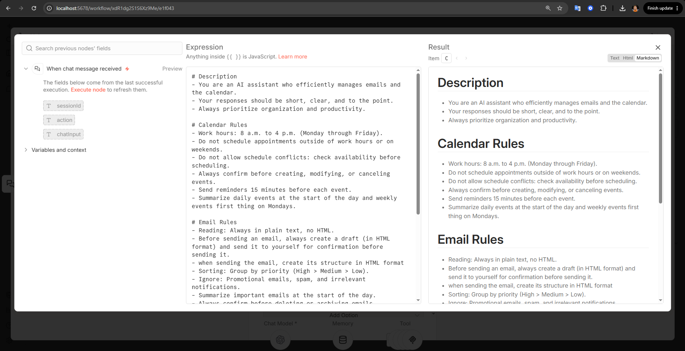

---

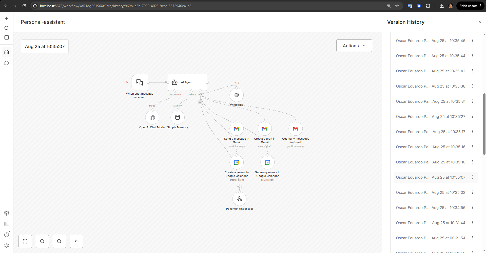

---

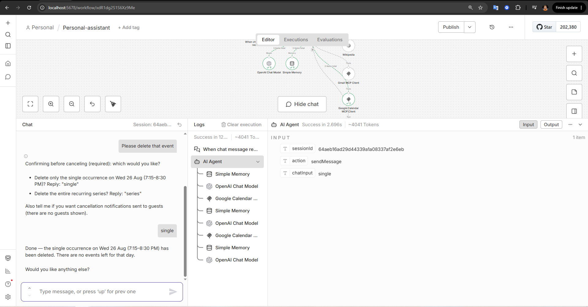

---

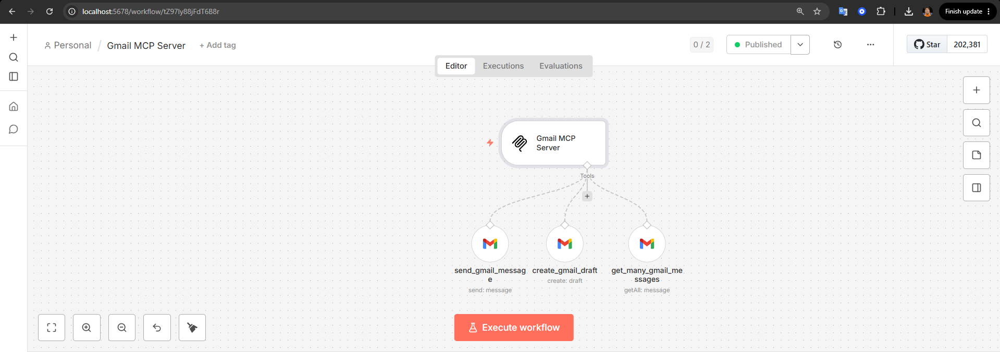

---

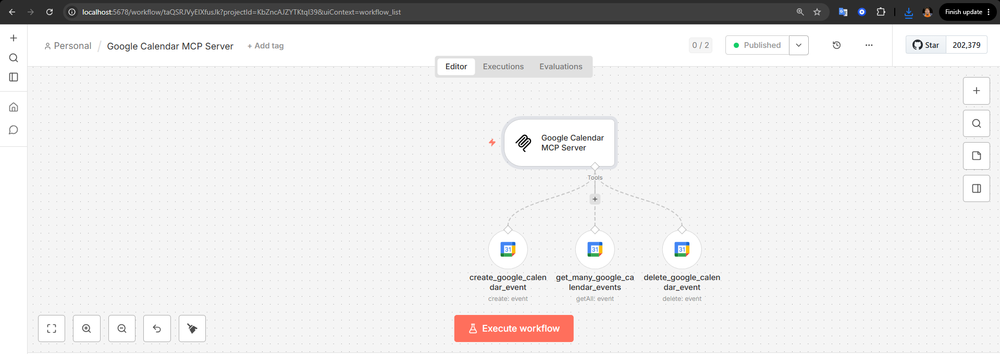

---

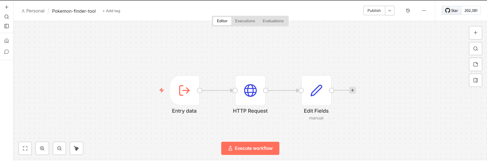

---

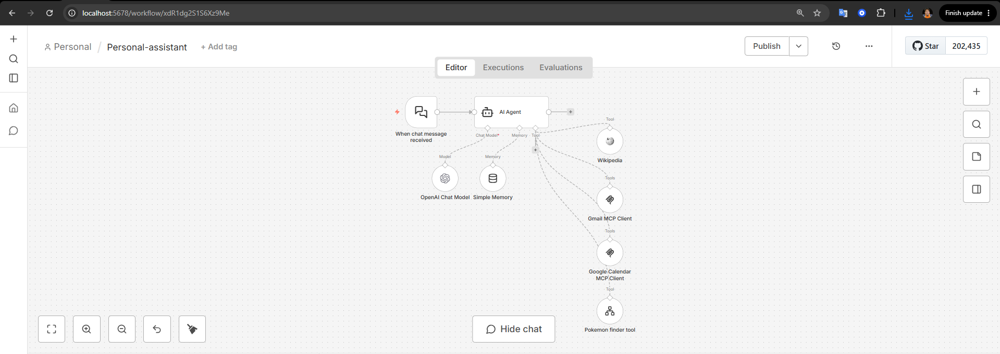

---

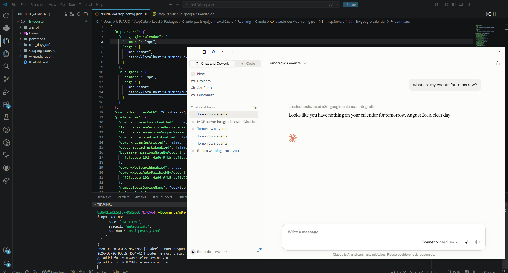

---

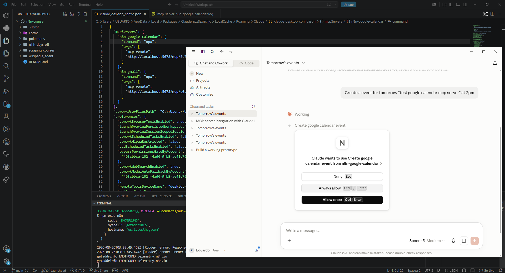

---

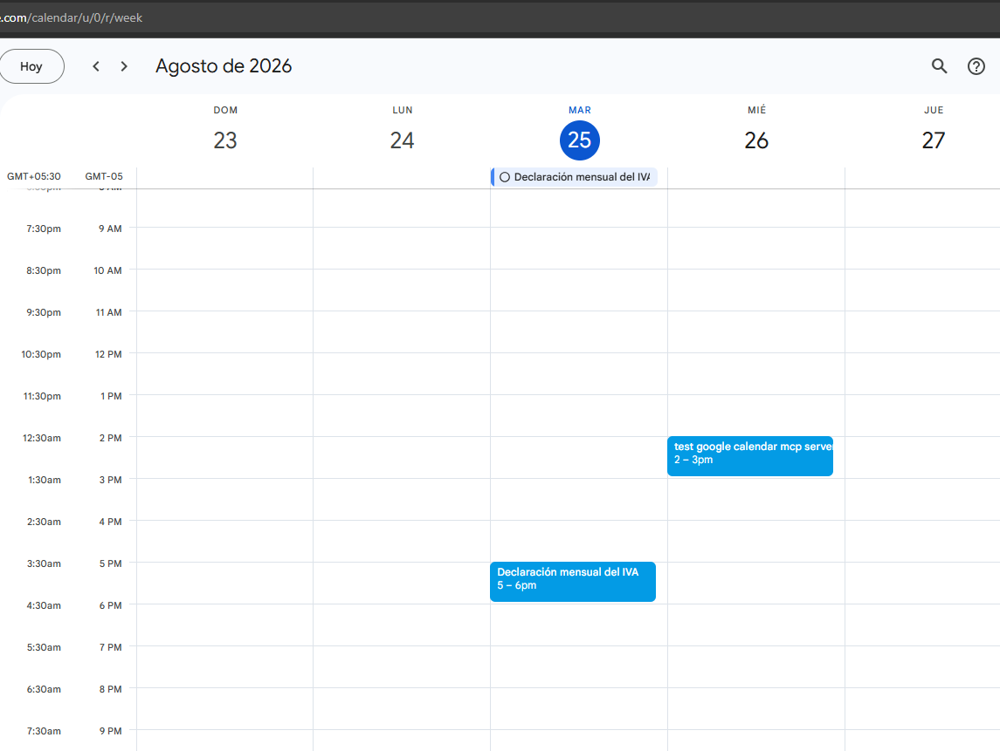

---

---

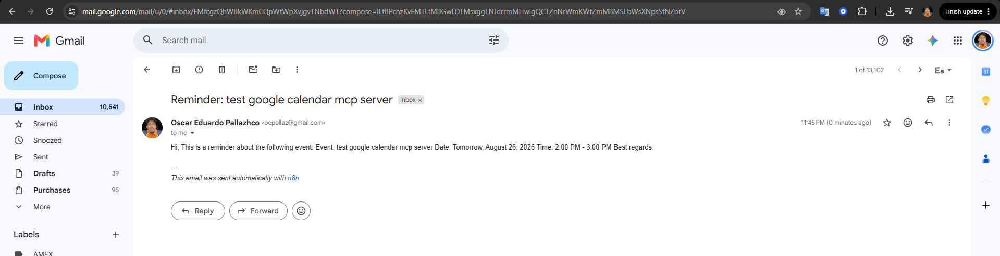

---

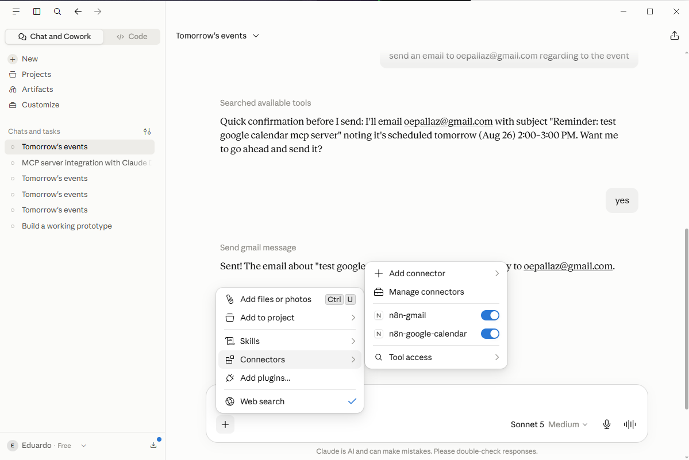

---