# RAG Workflow

This n8n workflow demonstrates how to build a **Retrieval-Augmented Generation (RAG)** system that allows an AI assistant to answer questions using a knowledge base built from documents stored in Google Drive.

The workflow is divided into two independent sections:

1. **Knowledge Base Provisioning** — discovers, processes, and indexes documents into a PostgreSQL vector database.
2. **AI Assistant** — retrieves relevant information from the vector database and uses it as context to answer user questions.

The provisioning process is also designed to be **incremental**: files that have already been processed and have not changed are skipped, while modified files are reprocessed and their outdated vectors are removed.

## Overview

At a high level, the workflow follows this architecture:

**Google Drive → File Discovery → Change Detection → Document Processing → Embeddings → PostgreSQL PGVector → AI Agent → Vector Retrieval → Response**

The knowledge base and the assistant are intentionally separated. They do not need to run at the same time, and the provisioning process only needs to be executed when the documents in the knowledge base are added or updated.

---

# 1. Knowledge Base Provisioning

The first section is responsible for maintaining the document-based knowledge base used by the AI assistant.

## Google Drive as the Knowledge Base

The workflow uses a **Google Drive folder as the source of the documents**.

The folder can contain subfolders. The workflow recursively searches the directory structure, allowing documents to be organized into multiple levels without requiring everything to be stored in a single folder.

When the provisioning workflow is executed, it:

1. Searches the configured Google Drive folder.
2. Recursively discovers files inside its subfolders.
3. Retrieves the metadata of the discovered files.
4. Determines whether each file has already been processed.
5. Checks whether the file has changed since the previous ingestion.
6. Processes only new or modified files.

## File Change Detection

To avoid unnecessarily processing the same documents repeatedly, the workflow maintains an `ingested_files` table.

The metadata of each processed file is stored in this table, including its **MD5 checksum**.

The checksum is used to determine whether the contents of a file have changed.

The logic is:

* **File has not been processed before** → Process the file.
* **File has been processed and its checksum has not changed** → Skip the file.
* **File has been processed but its checksum has changed** → Remove its previous vectors and process the updated file.

This creates an incremental ingestion mechanism and avoids unnecessary embedding operations.

## Removing Outdated Vectors

When a file has been modified, the workflow first removes the vectors associated with the previous version of that document.

This is important because otherwise the vector database could contain both the old and new versions of the document, potentially causing the AI assistant to retrieve outdated information.

To make this possible, the vector records include a `file_id` field that identifies the source file associated with each vector.

This makes it possible to efficiently identify and remove all vectors belonging to a specific document.

The workflow includes a wait step to ensure that the deletion process is completed before continuing with the ingestion of the new version.

## File Ingestion

After determining that a file needs to be processed, the workflow:

1. Stores the file's metadata in the `ingested_files` table.
2. Downloads the file from Google Drive as binary data.
3. Passes the document to the PostgreSQL **PGVector Store** ingestion process.
4. Loads and splits the document into smaller chunks.
5. Generates embeddings for the chunks.
6. Stores the resulting vectors in PostgreSQL.

The vector records also contain the `file_id` metadata, which allows the workflow to associate every vector with its original document.

---

# 2. Document Processing and Embeddings

The document ingestion pipeline uses several components to transform files into searchable vector representations.

### Data Loader

The **Default Data Loader** is used to extract the content from the downloaded files.

### Text Splitter

The extracted content is divided into smaller pieces using a **Recursive Character Text Splitter**.

Splitting documents into chunks is important for RAG systems because retrieving smaller, relevant sections generally provides the language model with more focused context.

### Embeddings

The resulting chunks are converted into vector embeddings.

These embeddings represent the semantic meaning of the document content and allow the system to perform similarity-based searches later.

### PostgreSQL PGVector Store

The generated embeddings are stored in PostgreSQL using the **PGVector Store**.

In addition to the vector representation, metadata such as `file_id` is stored alongside the vectors to maintain the relationship between indexed content and its source document.

---

# 3. AI Assistant

The second major section of the workflow is the AI assistant.

The assistant is built using an **AI Agent** connected to:

* An OpenAI chat model
* Simple Memory
* PostgreSQL PGVector Store as a tool

The key difference between this assistant and a standard AI chatbot is that it can retrieve information from the previously indexed knowledge base.

## Retrieving Information from the Knowledge Base

The PostgreSQL PGVector Store is exposed to the AI Agent as a tool.

When a user asks a question, the agent can query the vector database to find documents or document chunks that are semantically related to the question.

The retrieved content is then used as context to generate the final answer.

This is the core RAG process:

**User Question → Vector Search → Relevant Document Chunks → AI Agent → Answer**

The assistant therefore does not need to rely exclusively on the knowledge stored in the language model.

---

# Independent Workflow Sections

The provisioning and assistant sections are designed to operate independently.

### Knowledge Base Provisioning

Responsible for:

**Google Drive → File Detection → Change Detection → Document Processing → Embeddings → Vector Database**

### AI Assistant

Responsible for:

**User Question → AI Agent → Vector Search → Relevant Context → Answer**

They do not need to execute simultaneously.

However, the **knowledge base provisioning section should be executed first**, at least once, so that the vector database contains documents that the assistant can retrieve.

After the initial provisioning, the ingestion workflow only needs to be executed again when documents are added or modified.

This separation also makes the architecture easier to maintain and scale.

---

# Data Flow

The complete workflow can be summarized as follows:

```text
                         KNOWLEDGE BASE PROVISIONING

Google Drive
     │
     ▼
Search Files & Folders
     │
     ▼
Extract File Metadata
     │
     ▼
Check ingested_files
     │
     ├── File unchanged ──────────────► Skip
     │
     └── New or modified
              │
              ▼
       Delete Old Vectors
              │
              ▼
       Update ingested_files
              │
              ▼
        Download File
              │
              ▼
        Data Loader
              │
              ▼
       Text Splitter
              │
              ▼
          Embeddings
              │
              ▼
       PostgreSQL PGVector
```

The assistant operates independently:

```text
                         AI ASSISTANT

User
 │
 ▼
Chat Interface
 │
 ▼
AI Agent
 │
 ├── OpenAI Chat Model
 ├── Simple Memory
 └── PGVector Store Tool
          │
          ▼
   Vector Similarity Search
          │
          ▼
   Relevant Document Chunks
          │
          ▼
      AI Response
```

---

# Topics

This section introduces the fundamental concepts behind building a document-based RAG system with n8n.

### Topics covered

* **Retrieval-Augmented Generation (RAG)**
* **Vector databases**
* **PostgreSQL and PGVector**
* **Document embeddings**
* **Text splitting**
* **Data loaders**
* **Recursive Character Text Splitter**
* **AI Agents**
* **Vector search**
* **Using vector stores as AI Agent tools**
* **PostgreSQL queries and data management**
* **Google Drive integration**
* **Recursive directory traversal**
* **Document ingestion pipelines**
* **Incremental document processing**
* **File metadata and MD5 checksums**
* **Detecting modified documents**
* **Removing outdated vectors**
* **Maintaining document-to-vector relationships**
* **AI-powered question answering**

---

# Key Takeaway

This workflow demonstrates how to build a **complete RAG pipeline in n8n**, from document ingestion to AI-powered question answering.

One of the most important aspects of the workflow is that the knowledge base is **incrementally maintained**. Instead of reprocessing every document every time the workflow runs, the system uses file metadata and MD5 checksums to identify which documents actually need to be updated.

The `file_id` metadata stored alongside the vectors also provides a reliable way to remove outdated information when a source document changes.

The final architecture separates **knowledge base management** from **question answering**, making it easier to maintain and extend:

**Google Drive documents → Vector database → AI Agent → Context-aware answers**

This pattern can be adapted to many real-world use cases, such as internal company knowledge bases, documentation assistants, customer support systems, technical documentation search, and document-based chatbots.

---

# Screenshots

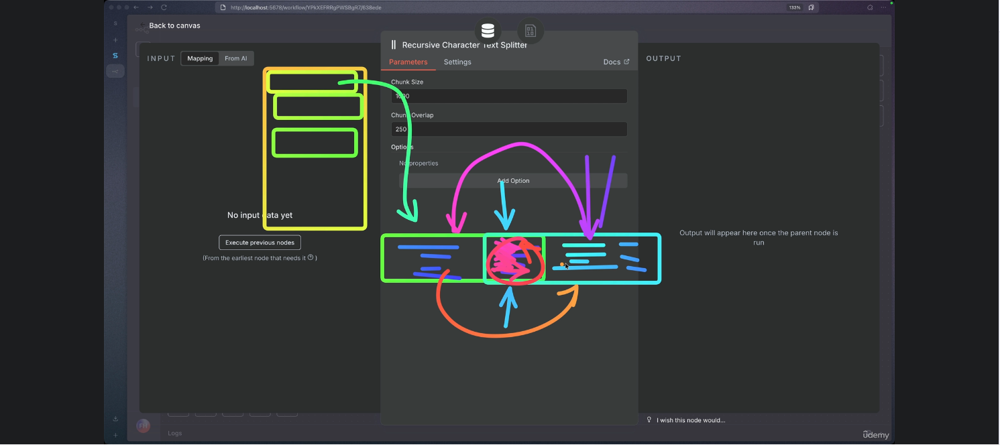

---

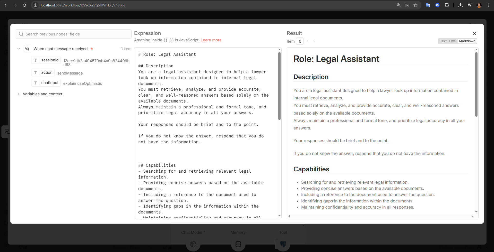

---

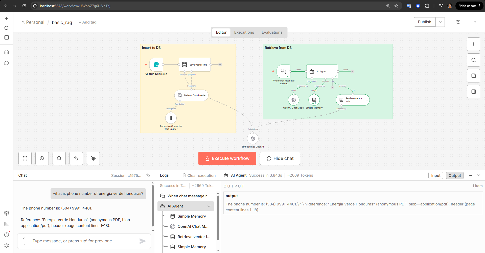

---

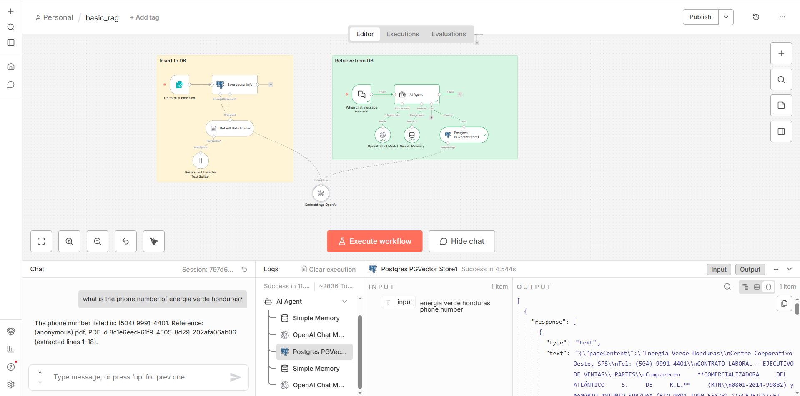

---

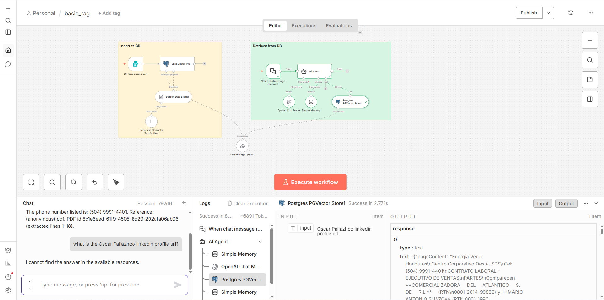

---

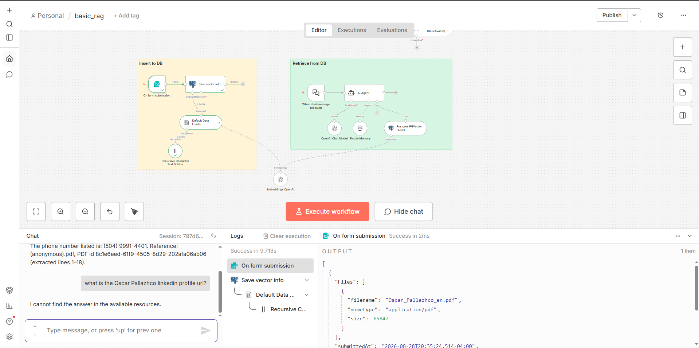

---

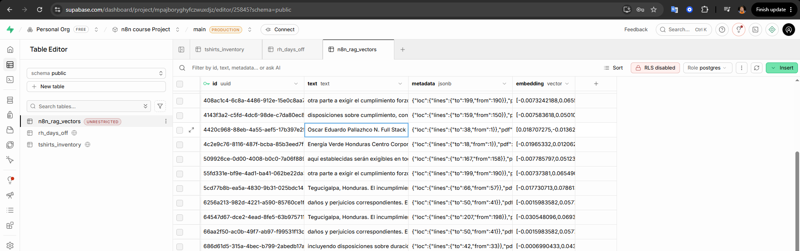

---

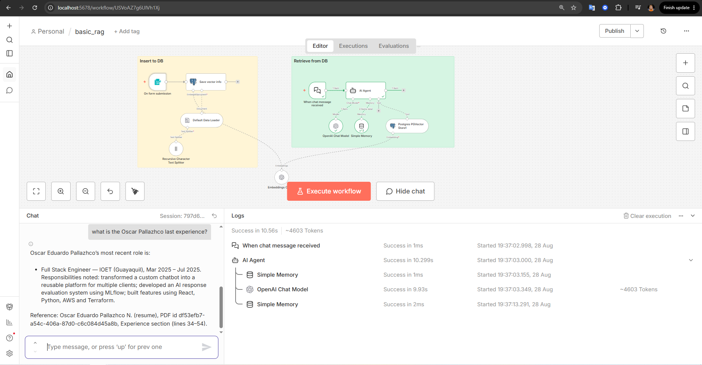

---

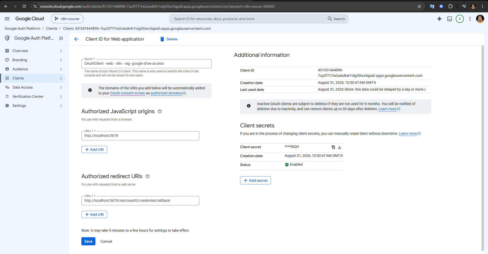

---

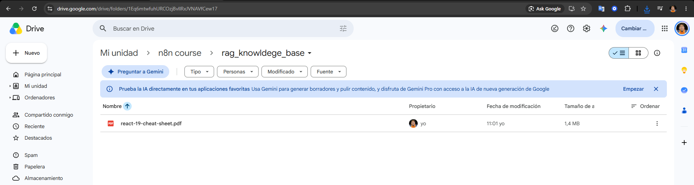

---

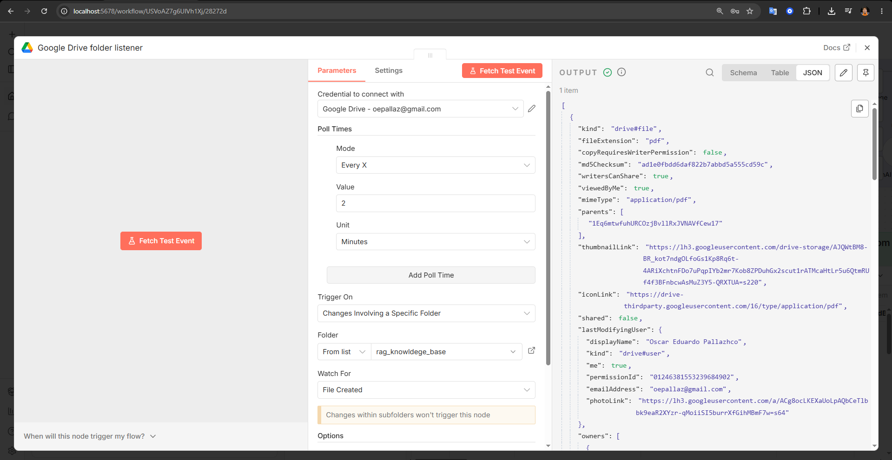

---


---

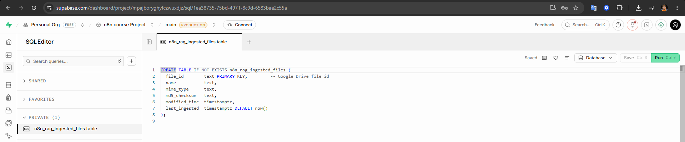

---

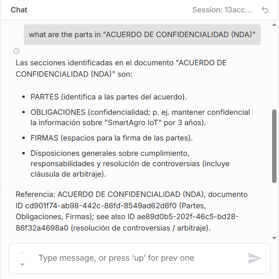

---

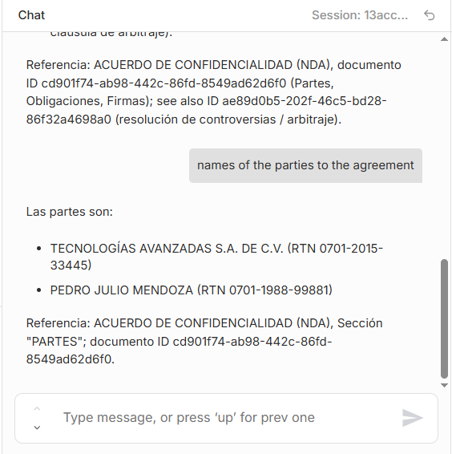

---

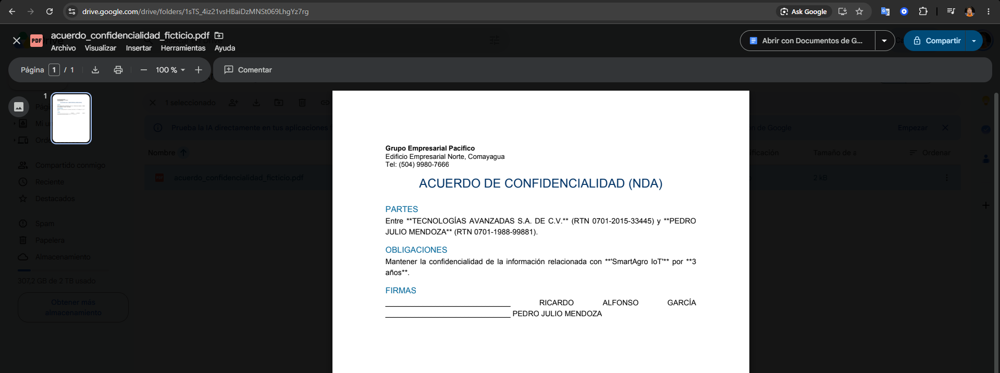

---

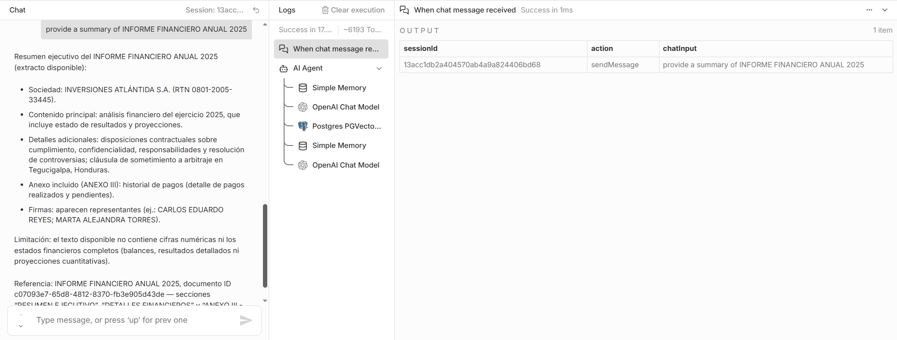

---

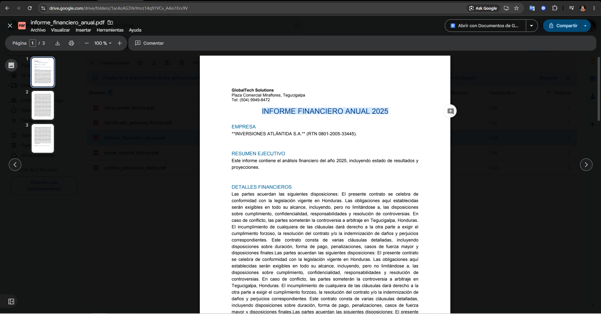

---

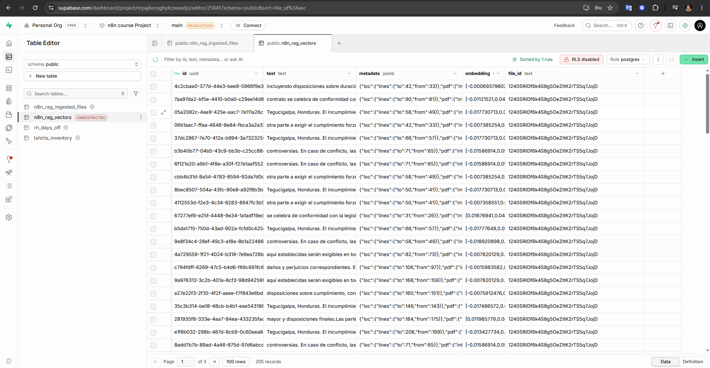

---

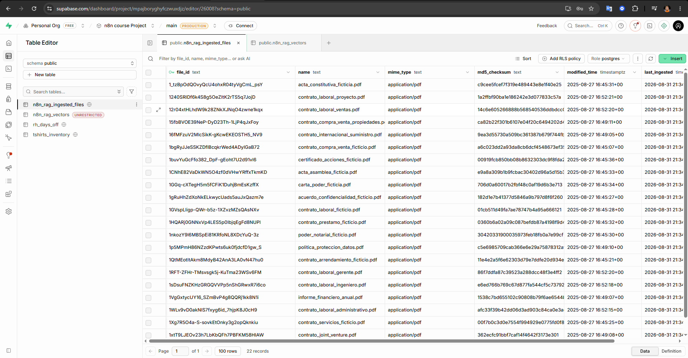

---

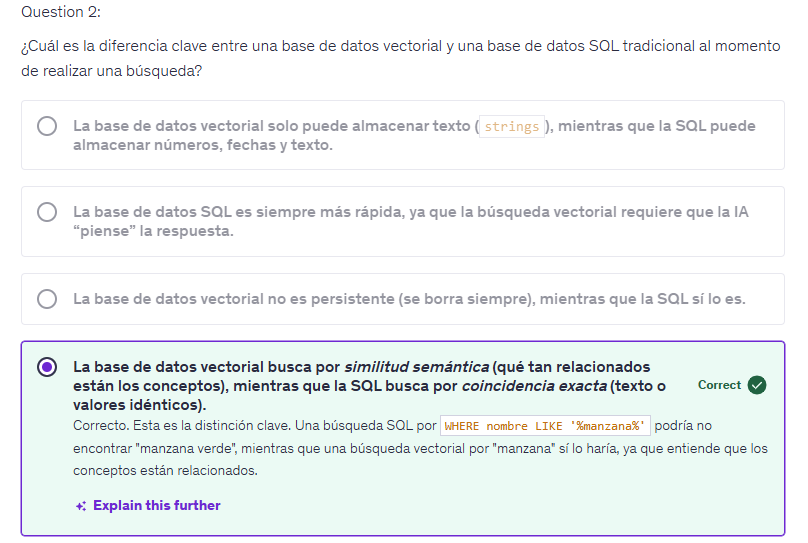

---

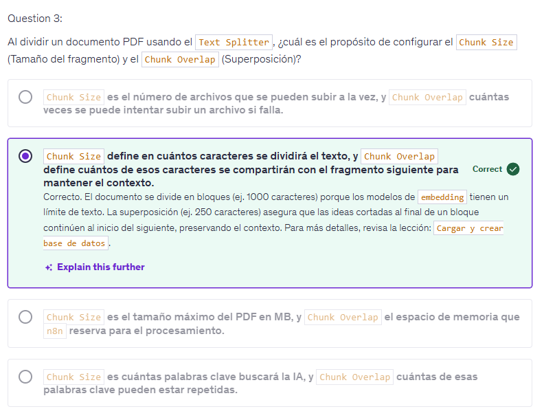
