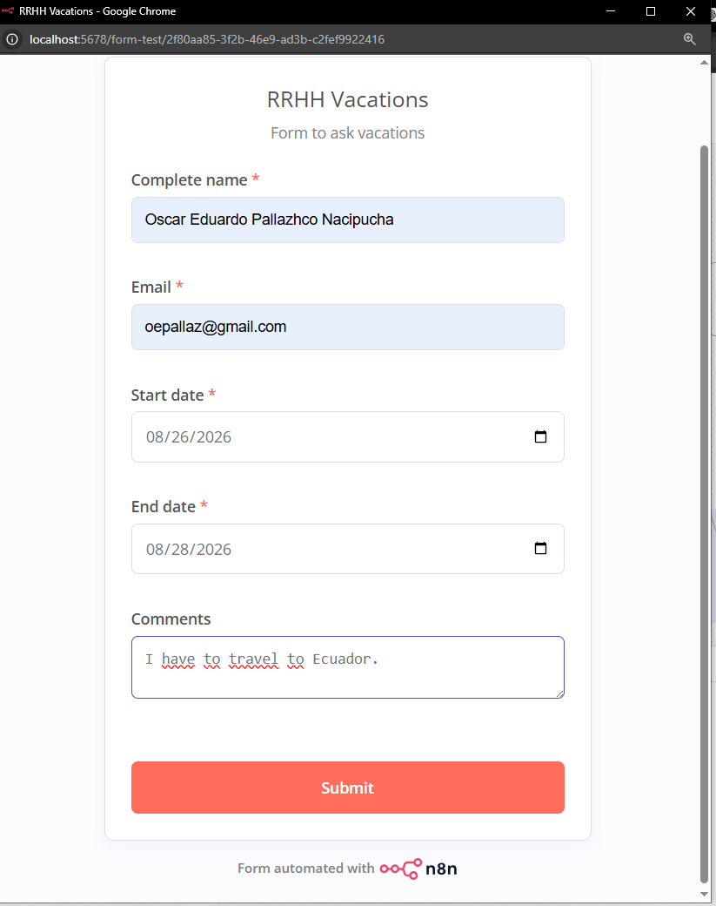
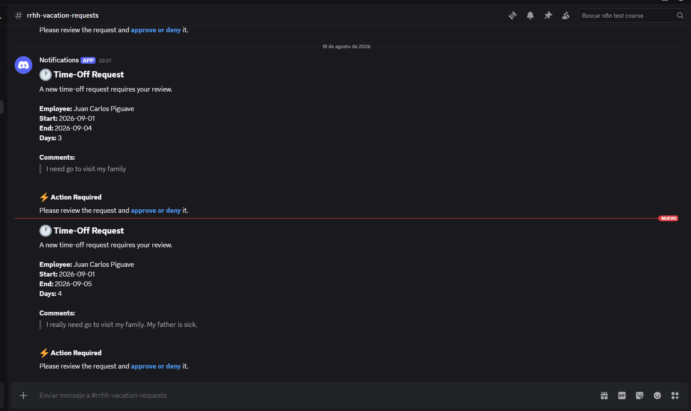
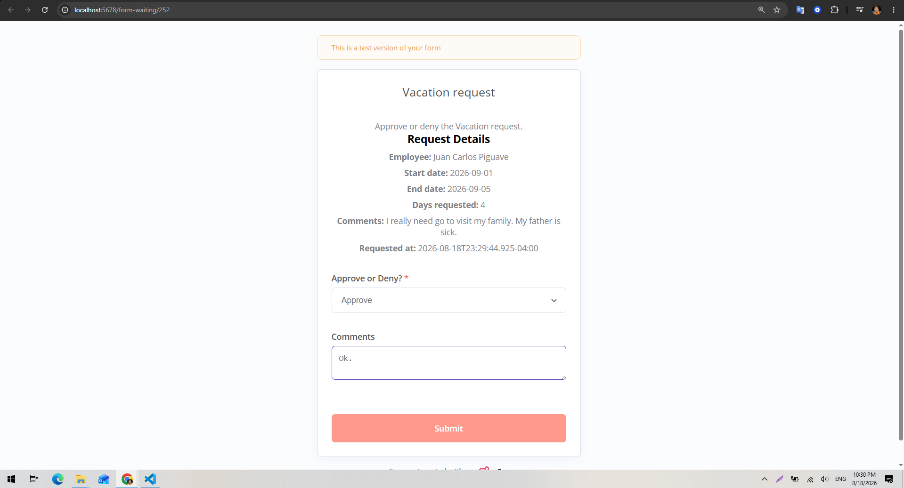
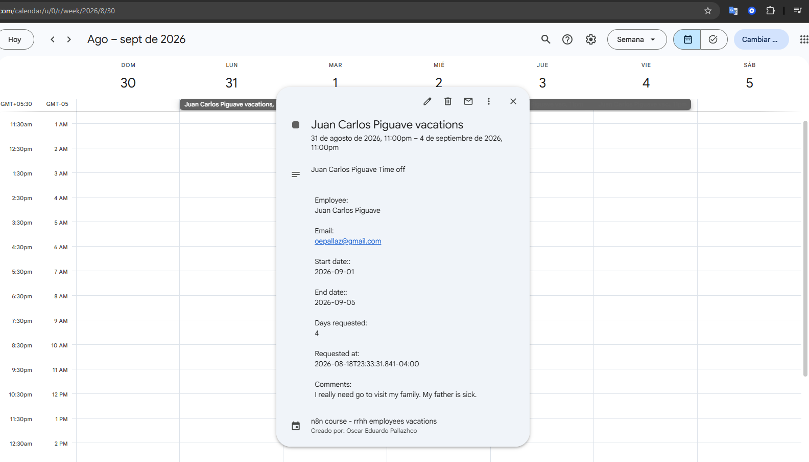
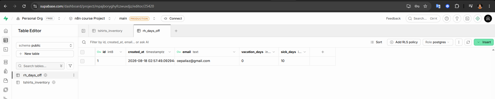
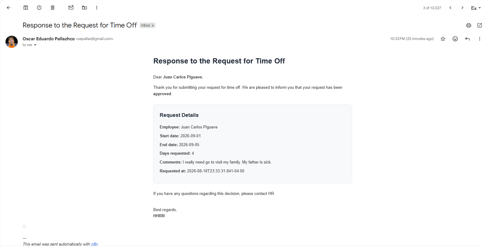
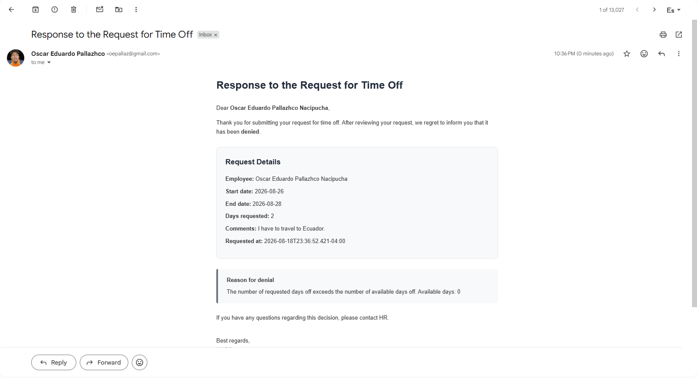
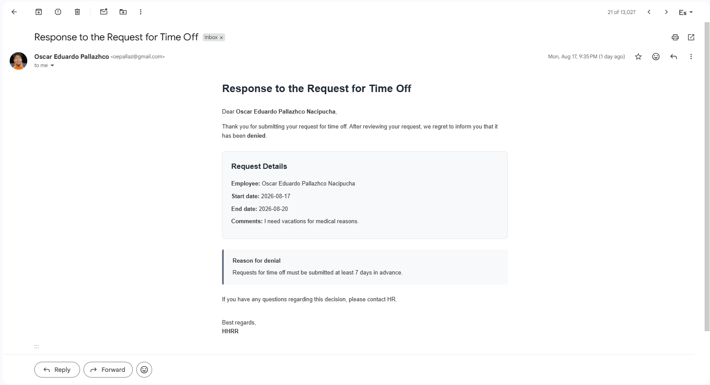
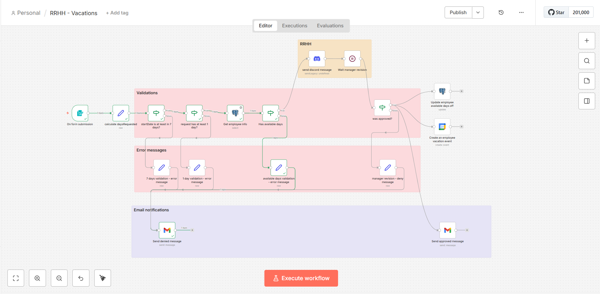
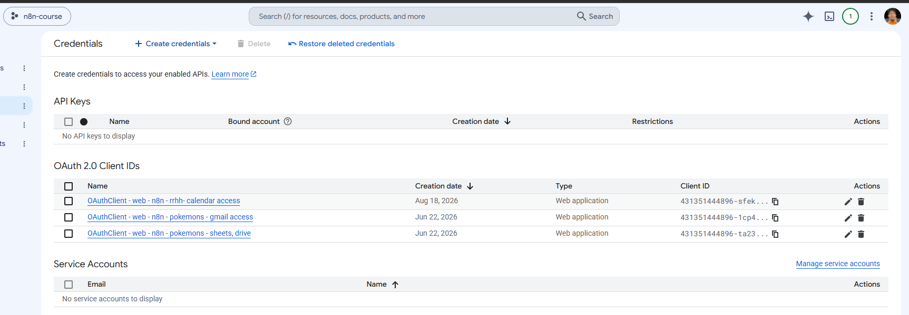

# RRHH — Vacation Request Workflow

This n8n workflow automates the employee vacation request and approval process, from the initial request to the final approval or rejection.

## Overview

The workflow provides employees with a form where they can submit a vacation request by specifying:

* Full name
* Email address
* Vacation start and end dates
* Additional comments or notes

Once submitted, the workflow validates the request and determines whether it can proceed.

If the request is invalid, the workflow automatically rejects it and notifies the employee by email, including the reason for the rejection.

If the request passes all validations, it is sent to the HR team for approval.

## Validation Rules

Before submitting a request for approval, the workflow performs the following validations:

1. **Minimum notice period**
   The vacation start date must be at least **one week in advance**.

2. **Valid date range**
   The vacation end date must be later than the start date.

3. **Available vacation days**
   The number of requested vacation days must not exceed the employee's available balance.

## Vacation Balance Lookup

The workflow retrieves the employee's available vacation days from a **PostgreSQL database hosted on Supabase**.

This information is used to determine whether the employee has enough available vacation days to fulfill the request.

## Approval Process

If the request passes all validations, the workflow sends a notification to a dedicated **Discord channel** accessible only to administrators or HR personnel responsible for handling vacation requests.

The Discord notification includes the relevant request information and a URL that leads to an approval form where HR personnel can:

* Approve the request
* Reject the request and provide a reason

The workflow then enters a **Wait** state while it waits for the HR decision.

The maximum response window is **two days**. If no decision is made within this period, the workflow can continue according to the configured timeout behavior.

## Rejected Requests

If HR rejects the request, the employee receives an email notifying them that their vacation request was denied.

The email includes the reason provided by the HR team.

## Approved Requests

When a vacation request is approved, the workflow performs the following actions:

1. **Notify the employee**
   Sends an email confirming that the vacation request has been approved.

2. **Update the vacation balance**
   Decreases the employee's available vacation days in the Supabase PostgreSQL database by the number of approved days.

3. **Create a Google Calendar event**
   Creates a vacation event in a dedicated Google Calendar accessible by the HR team. This provides a centralized record of employees who will be on vacation.

## Technologies and n8n Nodes

This workflow demonstrates the use of several n8n integrations and core nodes, including:

* **n8n Form nodes** — Collect vacation requests and HR decisions.
* **PostgreSQL / Supabase** — Retrieve and update employee vacation balances.
* **Discord** — Notify HR personnel about pending requests.
* **Wait** — Pause the workflow until an HR decision is received or the two-day response window expires.
* **Google Calendar** — Maintain a centralized vacation calendar.
* **Email** — Notify employees about approved or rejected requests.

## Workflow

The workflow covers the complete vacation request lifecycle:

**Employee submits request → Validate request → Check vacation balance → Notify HR → Wait for decision → Approve or reject → Update records and calendar**

## Screenshots

---

---

---

---

---

---

---

---

---

