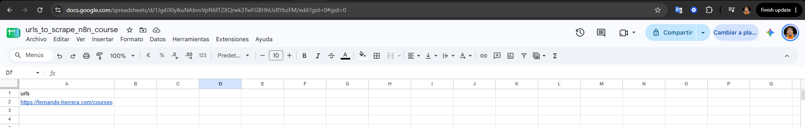
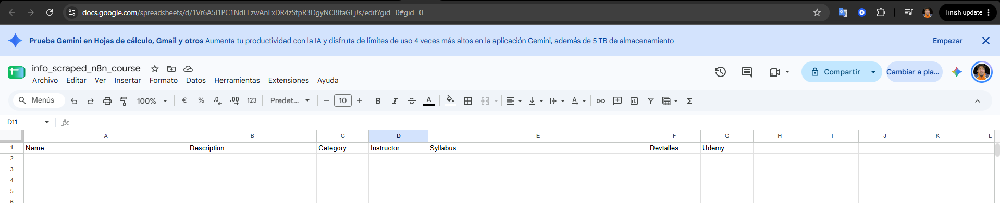
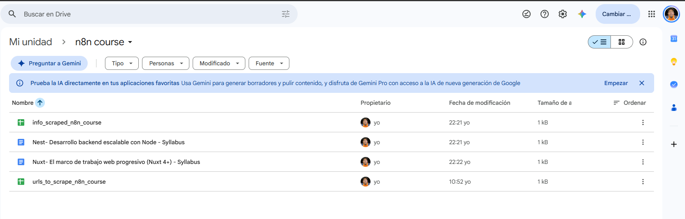
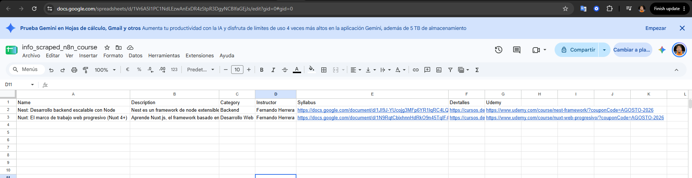
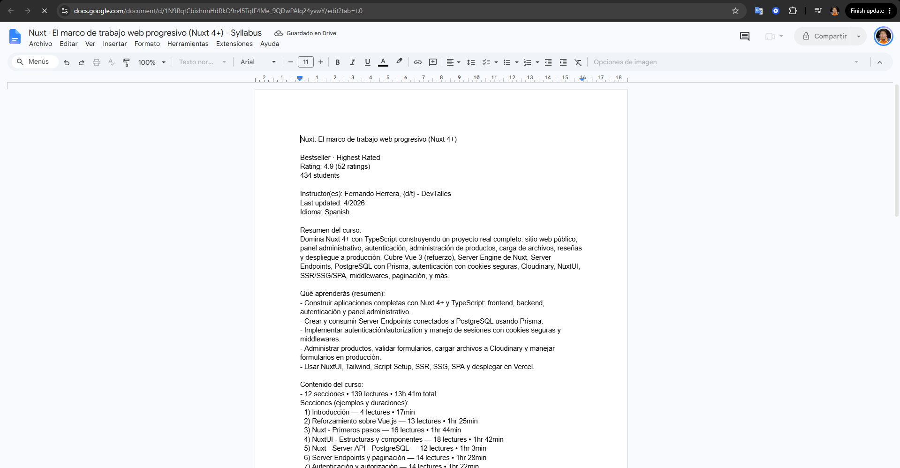
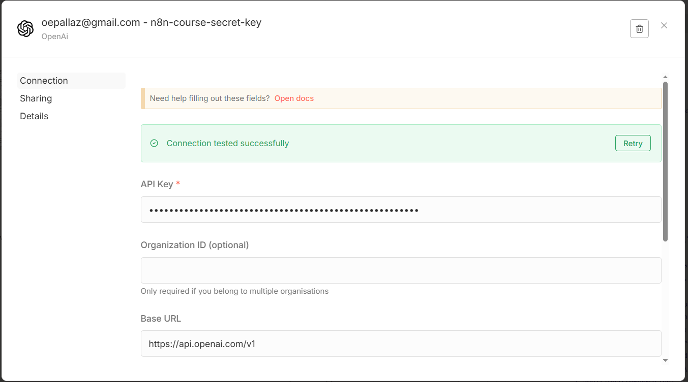
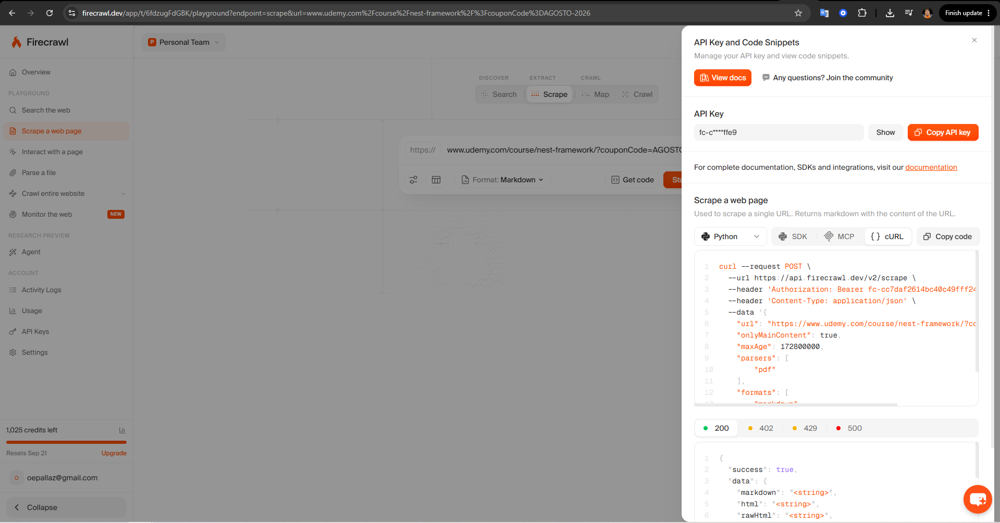

# Course Scraping Workflow

This n8n workflow automates the process of discovering, extracting, processing, and organizing course information from websites that do not provide a dedicated API.

The workflow combines **HTTP requests, HTML-to-Markdown conversion, OpenAI, Firecrawl, Google Sheets, Google Drive, and Google Docs** to build a structured database of courses and generate readable course outlines.

## Overview

The workflow starts by retrieving a list of website URLs from a **Google Sheet**. It then visits each website, extracts the available content, and uses an OpenAI model to identify relevant course information.

For each course found, the workflow collects additional information from the course page—even when the page has protection that prevents a standard HTTP request—from Firecrawl. The extracted information is then processed with OpenAI and stored in a dedicated Google Doc.

The resulting Google Doc URL is also added to the corresponding record in the output Google Sheet.

## Workflow

The workflow follows these main steps:

1. **Get URLs from Google Sheets**
   Retrieves the websites that need to be processed from a Google Sheet.

2. **Fetch website content**
   Uses the **HTTP Request** node to retrieve the HTML content of each website.

3. **Convert HTML to Markdown**
   Converts the retrieved HTML into Markdown, making the content easier for an AI model to process.

4. **Extract course information with OpenAI**
   Sends the Markdown content to an OpenAI model with instructions to identify relevant courses and extract information such as:

   * Course name
   * Description
   * Instructor
   * Course URL
   * Other relevant course information

5. **Limit the number of results**
   The workflow limits the number of courses processed to a maximum of **two results per source**. This helps control the number of subsequent API requests to Firecrawl and OpenAI.

6. **Iterate through the courses**
   Each course is processed individually.

7. **Store the initial results**
   The extracted course information is saved to the output Google Sheet.

8. **Scrape protected course pages**
   Some course URLs cannot be accessed reliably using a standard HTTP Request node due to website security or anti-bot protections.

   For these pages, the workflow uses **Firecrawl** to retrieve the content in a way that more closely resembles a browser-based request.

9. **Create a Google Doc for each course**
   A new Google Doc is created to store the detailed information extracted from the course page.

10. **Update the results sheet**
    The URL of the newly created Google Doc is added to the corresponding course record in the Google Sheet.

11. **Process the course content with OpenAI**
    The detailed course information retrieved from the page is sent to OpenAI with instructions to identify the most relevant information and organize it into a clear, easy-to-read format.

12. **Save the final content**
    The formatted course information is written to the Google Doc created for that course.

## Topics

This workflow demonstrates how to build an n8n automation for extracting information from websites **with and without anti-bot protection**, processing that information with AI, and storing the results in an organized knowledge base.

### Topics covered

* **HTTP Request node** and useful shortcuts
* **Google Sheets**
* **Google Drive**
* **Google Docs**
* **Firecrawl**
* **Markdown node**
* **OpenAI model messages and prompts**
* **Structured JSON responses from AI models**
* **Iterating over multiple results**
* **Updating existing records**
* **Working with websites that do not provide an API**

## Architecture

At a high level, the workflow can be summarized as:

**Google Sheets → HTTP Request → HTML → Markdown → OpenAI → Course List → Iterate Courses → Firecrawl → Google Docs → OpenAI → Course Content → Google Docs → Update Google Sheets**

The first stage focuses on **discovering courses**, while the second stage performs a deeper extraction of each individual course.

## Why Firecrawl?

Some course pages cannot be accessed using a regular HTTP Request because the website applies security mechanisms or anti-bot protection.

Firecrawl is used as an alternative scraping service for these pages, allowing the workflow to retrieve the course content and continue the processing pipeline.

This makes the workflow useful for sources where a conventional HTTP request is insufficient.

## Output

The final result is a Google Sheet containing the discovered courses and their associated information.

Each course also receives its own Google Doc containing a cleaned and structured version of the relevant course content, including the information extracted and formatted by OpenAI.

This creates a simple workflow for turning unstructured website content into a **structured course database and a readable course syllabus/catalog**.

## Screenshots

---

---

---

---

---

---

---

