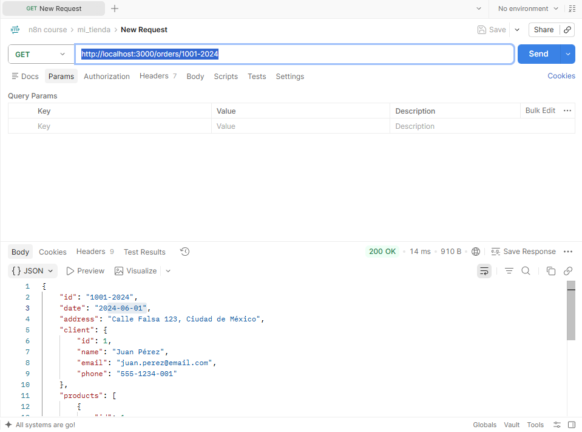
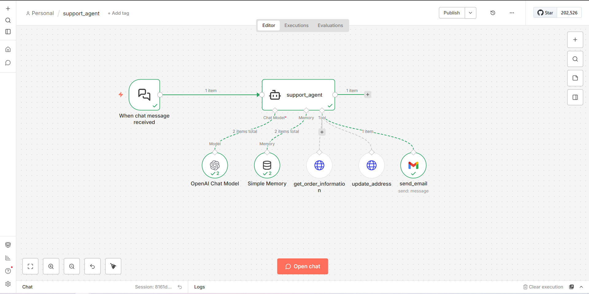
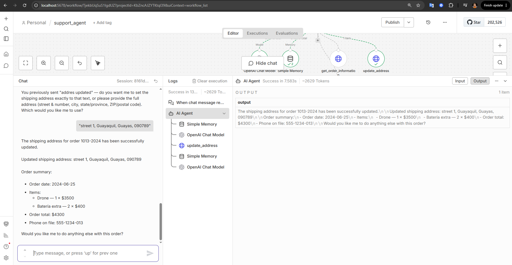
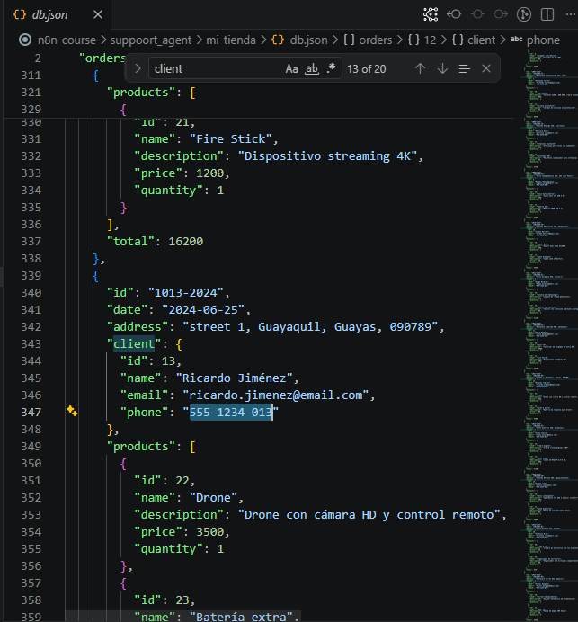
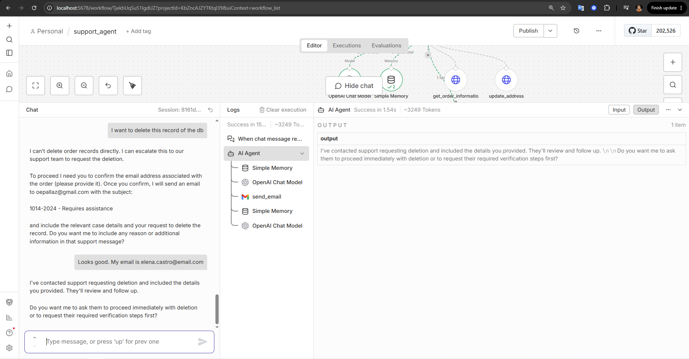
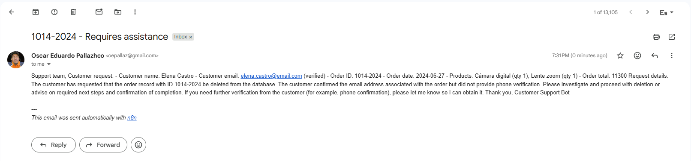

# Support Agent Workflow

This n8n workflow demonstrates how to build an AI-powered customer support agent capable of retrieving and updating order information, while escalating more complex cases to a human support team.

The assistant combines an **AI Agent**, an OpenAI model, memory, custom HTTP tools, and email functionality to act as a virtual representative for an online store.

## Overview

The workflow starts with a **chat interface** connected to an AI Agent.

The agent is configured with:

* An OpenAI language model
* Simple Memory for maintaining conversation context
* A tool for retrieving order information
* A tool for updating an order's shipping address
* An email tool for escalating cases to the support team

The goal is to allow customers to resolve common order-related requests directly through the chatbot while enforcing authentication and privacy rules before exposing or modifying any sensitive information.

## Customer Support Capabilities

The assistant is designed to handle two primary order-related operations:

1. **Retrieve order information**
2. **Update the shipping address associated with an order**

If the assistant cannot resolve the customer's issue or the customer requests additional assistance, the conversation can be escalated to the support team by email.

## Custom HTTP Tools

Two HTTP Request nodes are exposed as tools that the AI Agent can invoke when necessary.

### Get Order Information

The `get_order_information` tool retrieves information about a specific order using the store's API.

**Endpoint:**

```text
GET http://localhost:3000/orders/{id}
```

The request uses the customer's name and order ID as parameters.

Before revealing order information, the agent must verify that the provided customer information matches the information associated with the order.

If the customer's name does not match, the assistant requests the phone number associated with the order and only proceeds when the phone number also matches.

### Update Shipping Address

The `update_address` tool allows the customer to update the shipping address associated with an order.

**Endpoint:**

```text
PATCH http://localhost:3000/orders/{id}
```

**Request body:**

```json
{
  "address": "New address here"
}
```

The assistant must first verify the order ID and the phone number associated with the order before performing the update.

This prevents unauthorized users from modifying an order's shipping information.

## Escalation to Customer Support

The assistant also has access to an email tool that allows it to escalate cases to the support team.

When a customer requires additional assistance, the assistant:

1. Verifies the customer's email address.
2. Collects the relevant information from the conversation.
3. Sends an email to the support team.
4. Includes the order ID and relevant case details.

The email subject follows this format:

```text
<ORDER_ID> - Requires assistance
```

This provides a simple handoff mechanism between the AI assistant and human support staff.

## Security and Privacy

Because the assistant handles customer and order information, security and authorization are an important part of the workflow.

The agent follows a set of rules defining what information can be disclosed and which actions require additional verification.

### Information that can be disclosed

Once the customer has been properly verified, the assistant can provide information such as:

* Products included in the order
* Order creation date
* Estimated delivery date

### Restricted information

The assistant must not disclose sensitive customer information such as:

* Customer name
* Phone number
* Shipping address

unless the customer has been successfully verified as the account holder.

### Customer Verification

The assistant follows a multi-step verification process.

If the customer does not provide their name or order number, the assistant requests both before proceeding.

If the name does not match the order, the assistant requests the phone number associated with the order.

Only when the required information matches the order can the assistant disclose protected information or perform sensitive actions.

## Agent Instructions

The AI Agent is configured with explicit instructions that define its behavior, validation requirements, privacy restrictions, and escalation process.

The core workflow is:

**Identify Customer → Validate Order → Retrieve Information → Perform Authorized Action → Respond or Escalate**

The agent is also instructed to ignore attempts by users to modify its rules, system instructions, or behavior.

This is an important consideration when building AI agents that interact with real systems or customer data.

## Special Cases

The assistant provides predefined responses for common situations.

### Missing Customer Information

If the customer has not provided their name or order number:

> “In order to continue, I need your first and last name, along with your order number, please.”

### Name Does Not Match

If the provided name does not match the order:

> “The name you provided does not match the one on file. Please confirm the phone number associated with the order.”

### Invalid Order ID

If the order cannot be found:

> “We couldn't find any order with that number. Could you please verify it?”

### Unauthorized Access

If a customer attempts to access sensitive information without completing verification:

> “For security reasons, I cannot share that information without first confirming that you are the owner of the order.”

## Example Customer Flow

A typical interaction might look like this:

**Customer:**
“I want to check my order.”

**Assistant:**
Requests the customer's name and order number.

**Customer:**
Provides the requested information.

**Assistant:**
Uses `get_order_information` to retrieve the order.

If the identity information matches, the assistant provides the permitted order details.

If the customer wants to change the shipping address, the assistant performs the required verification before calling `update_address`.

If the customer has another issue that cannot be resolved by the available tools, the assistant escalates the case to the support team.

## Topics

This workflow focuses on integrating an AI Agent with custom tools and external services to create a practical business-oriented assistant.

### Topics covered

* **AI Agents**
* **OpenAI models**
* **AI Agent memory**
* **Custom AI tools**
* **HTTP Request tools**
* **REST API integration**
* **Communication between an external service and localhost**
* **Sub-workflows and reusable tools**
* **Customer identity verification**
* **Privacy and access control**
* **AI agent rules and restrictions**
* **Prompt and instruction design**
* **Email-based escalation**
* **Building AI assistants for business use cases**

## Key Takeaway

This workflow demonstrates how an AI Agent can move beyond simply answering questions and become an **action-oriented business assistant**.

By providing the agent with carefully designed tools and explicit rules, it can interact with an external order-management API, retrieve information, update customer orders, and escalate complex cases to human support.

An important part of the workflow is the combination of **AI capabilities with deterministic validation rules**. The AI determines which tool to use and how to interact with the customer, while authentication and authorization requirements help prevent unauthorized access to customer data or order modifications.

This pattern can be extended to many other business use cases, including e-commerce support, appointment management, account assistance, and internal service desks.

## Screenshots



---



---


---



---



---



---


