# Telegram Assistant Workflow

The workflow created here implements a **Telegram chatbot** capable of processing text, voice notes, and photos.

## Setup

Because Telegram triggers cannot be tested locally without a publicly accessible webhook, it was necessary to run **n8n through Docker**. The Docker Compose file is located in this directory.

First, fill in the required environment variables in the `.env` file. These variables use the domain provided by [ngrok](https://ngrok.com/).

Then run:

```bash
docker compose up -d
```

### Telegram Bot Setup

The bot must first be created through the Telegram platform.

1. Search for **@BotFather** in Telegram.
2. Follow the instructions to create a new bot.
3. Telegram will provide an **access token**.
4. Use this access token to create the Telegram credentials in n8n and execute the Telegram nodes.

## Bot Interactions

The bot supports four types of interactions:

### 1. `/start` Message

When the user sends the `/start` command:

* The workflow makes an HTTP request to the **GIPHY API** to obtain a greeting sticker.
* It retrieves the sticker URL.
* The sticker is sent back to the user through Telegram.

### 2. Text Message

When the user sends a text message:

* The workflow sends the message to an **OpenAI agent**.
* The agent generates a response.
* The response is sent back to the user as a text message.

### 3. Voice Note

When the user sends a voice note:

* The workflow uses the Telegram node to retrieve the audio file.
* The audio file is downloaded.
* OpenAI is used to transcribe the audio.
* The transcription is passed to the AI agent.
* The agent generates a response.
* Since the original message was a voice note, the workflow responds with audio as well.
* OpenAI's audio generation node is used to convert the agent's response into speech.
* The generated audio is sent back to the user through Telegram.

It is important to generate the audio using the **OPUS** output format, as this is the format used by Telegram for voice messages.

Additionally, the workflow includes the option to generate audio using **ElevenLabs**. This requires:

* Available credits in the ElevenLabs account.
* An ElevenLabs API key.
* An ElevenLabs credential configured in n8n.

ElevenLabs provides a wider selection of voices and generally more realistic voice generation.

### 4. Photo

When the user sends a photo, the workflow:

* Selects one of the highest-resolution versions provided by Telegram, since Telegram provides multiple resolutions of the same image.
* Retrieves the image file from Telegram.
* Uses OpenAI to analyze the image.
* If the user included a caption, the caption is used as the user prompt sent to OpenAI.
* Otherwise, a default prompt is used to ask OpenAI to describe what is present in the image.
* The result is sent back to the user as a text message through Telegram.

## Topics

This section covers the development of a **multimodal Telegram bot** capable of processing audio, text, and photographs through an AI agent.

Specifically, we will cover:

* Telegram Bots
* Sending Stickers
* Sending Text
* Recording and Processing Audio
* Processing and Analyzing Images
* Responding in Different Formats
* Connecting Telegram to a Local Environment
* ngrok
* ElevenLabs

## Screenshots

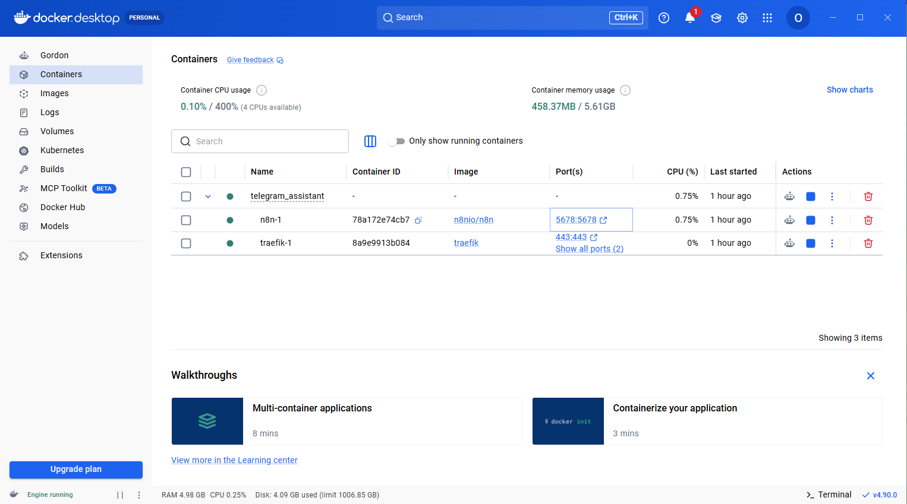

---

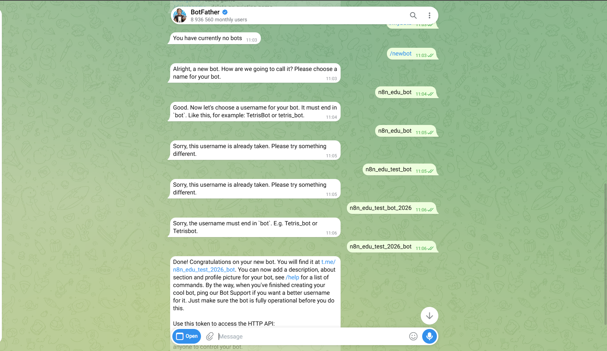

---

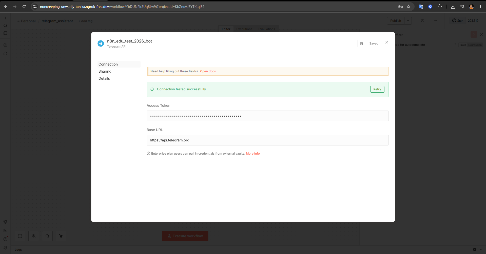

---

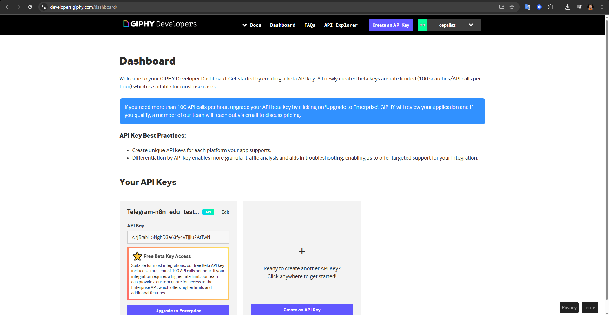

---

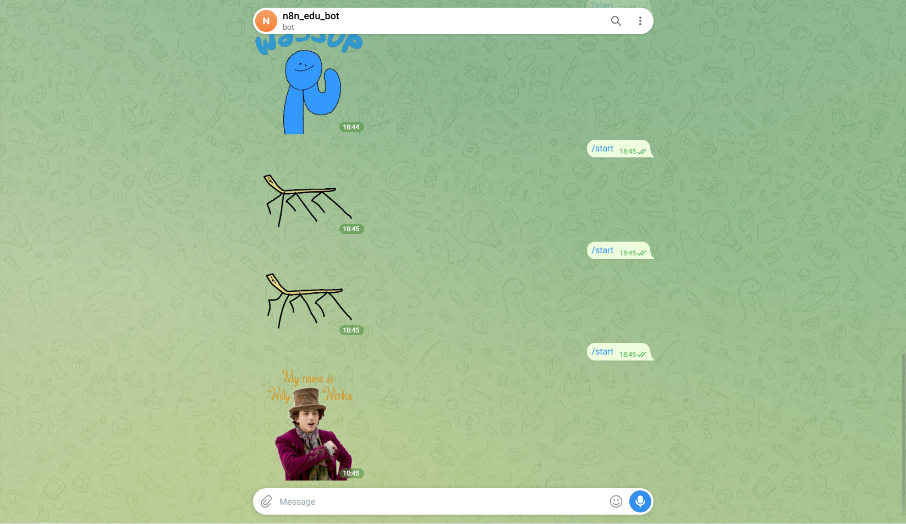

---


---

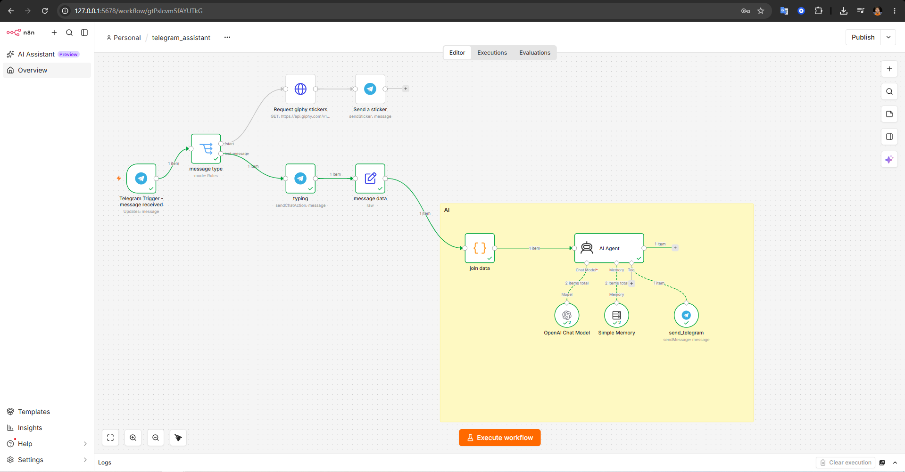

---

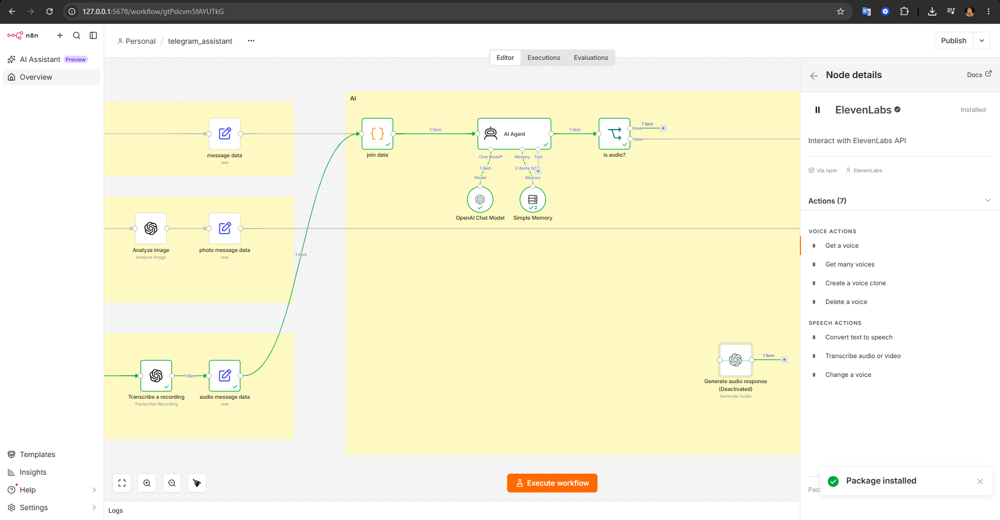

---

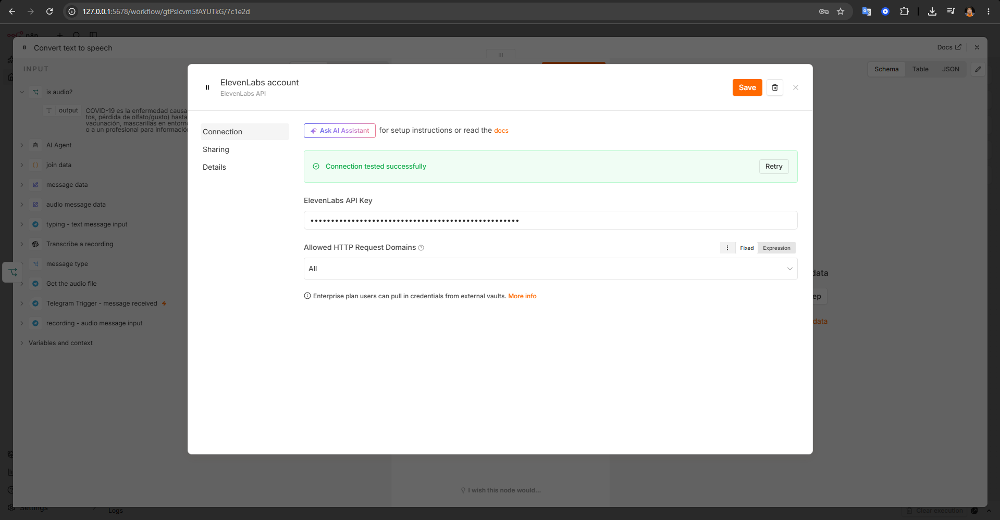

---

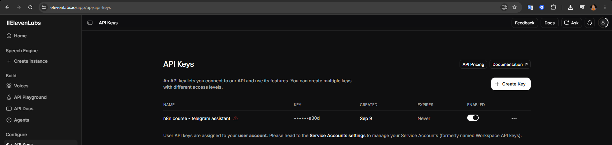

---

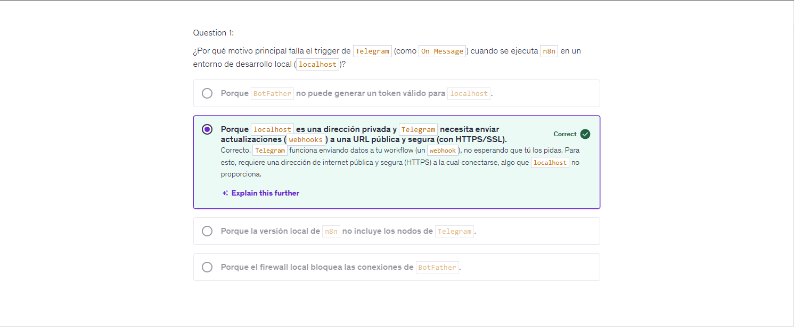

---

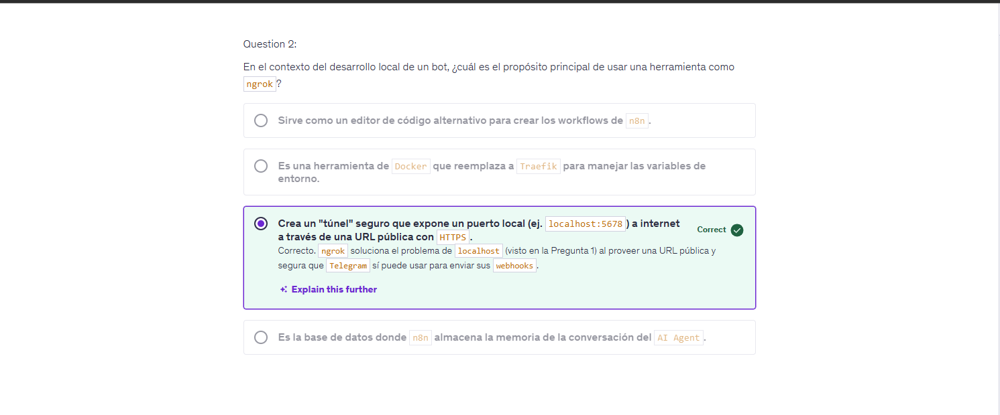

---

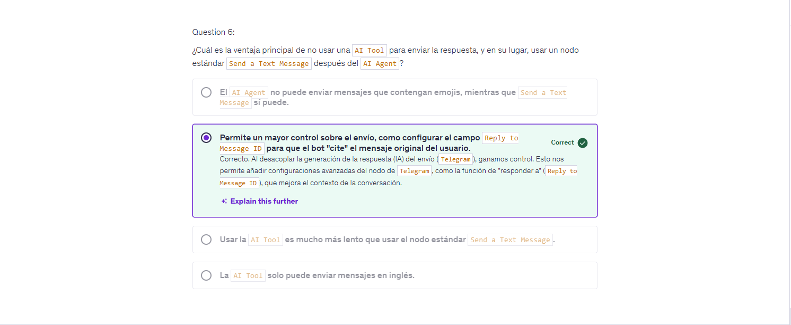

---

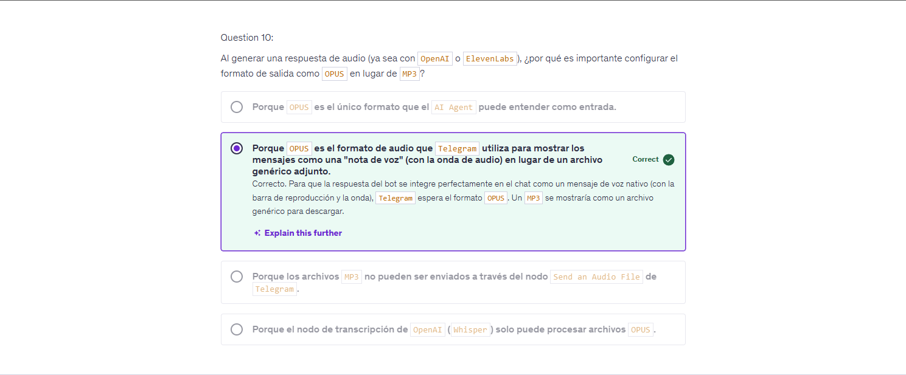

---

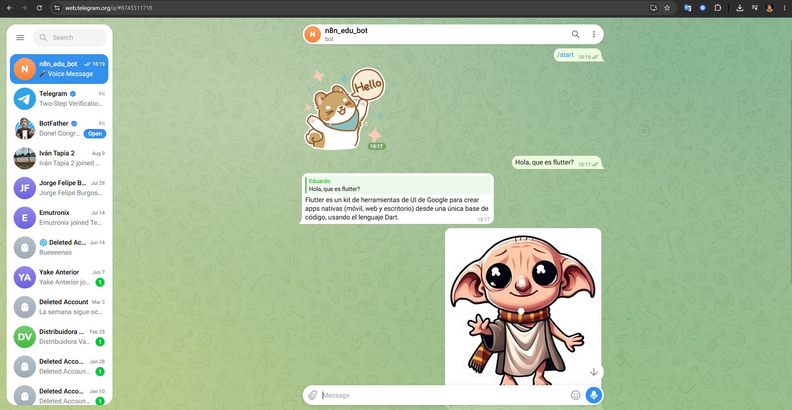

---

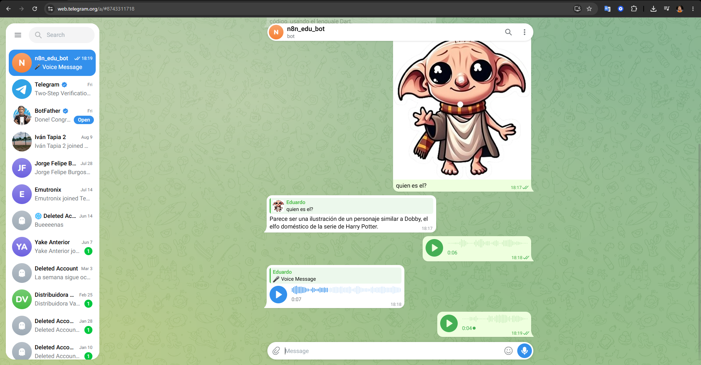

---

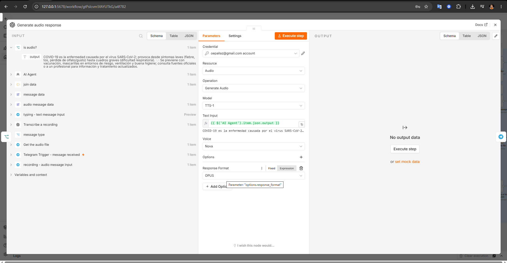

---

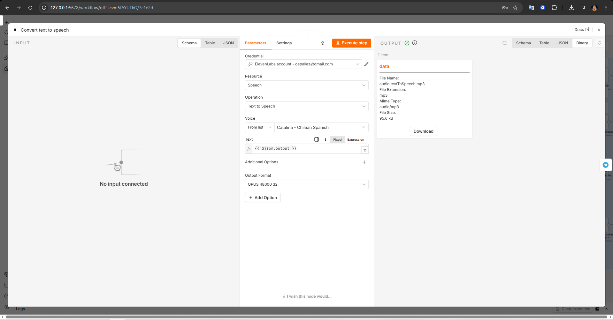

---

[Watch the Telegram Assistant demo video](https://drive.google.com/file/d/17QDYh73W07GnGIKt0yfvEk05LWD0EAaY/view?usp=sharing)

---
