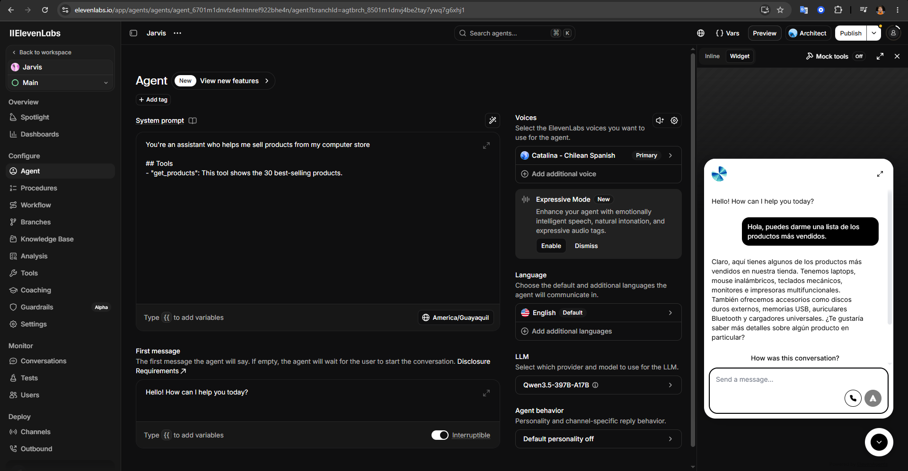
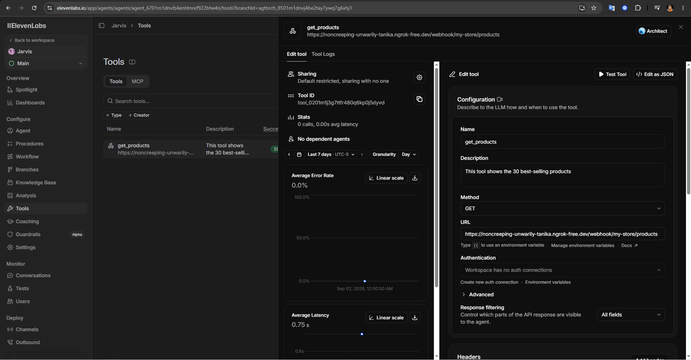
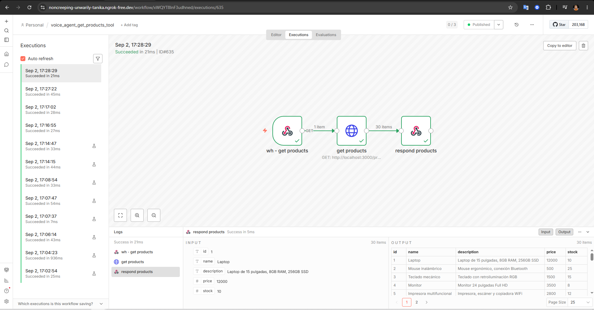
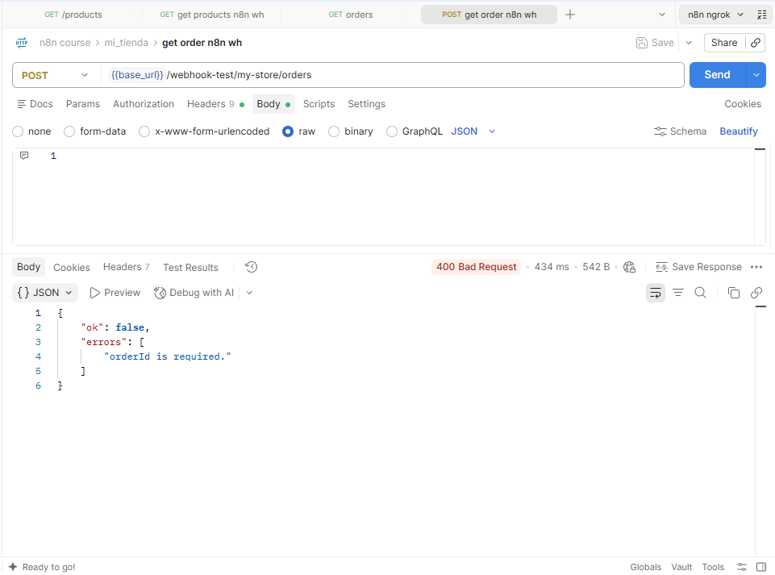
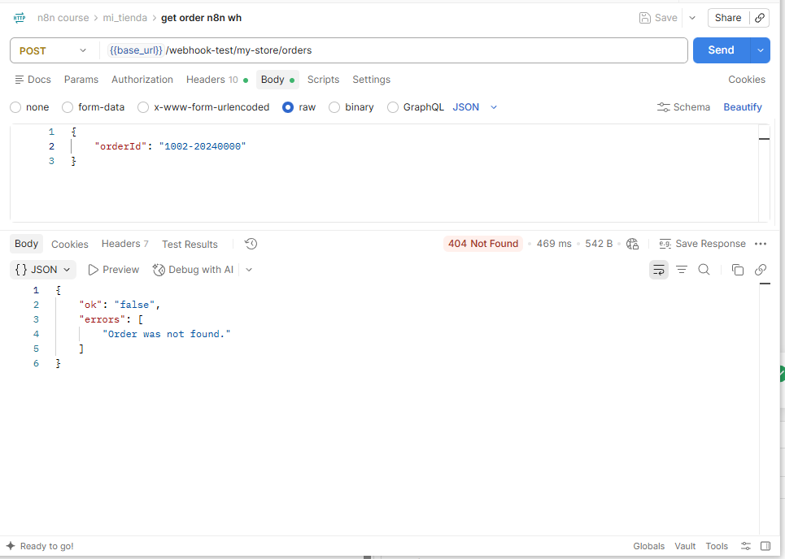
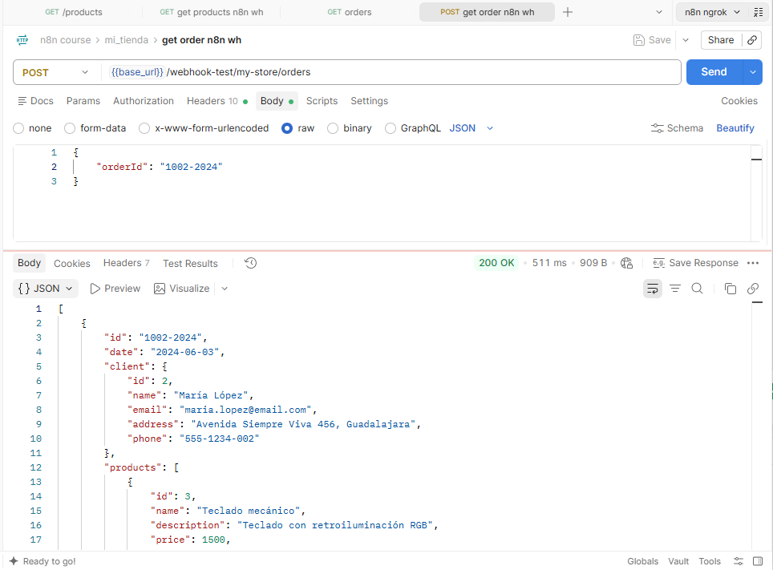
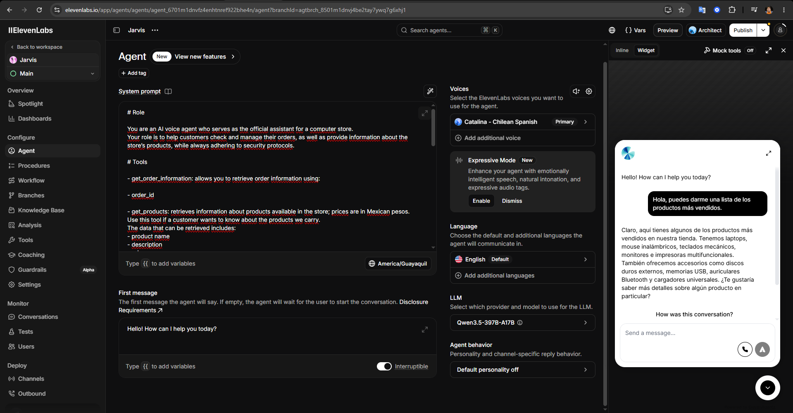
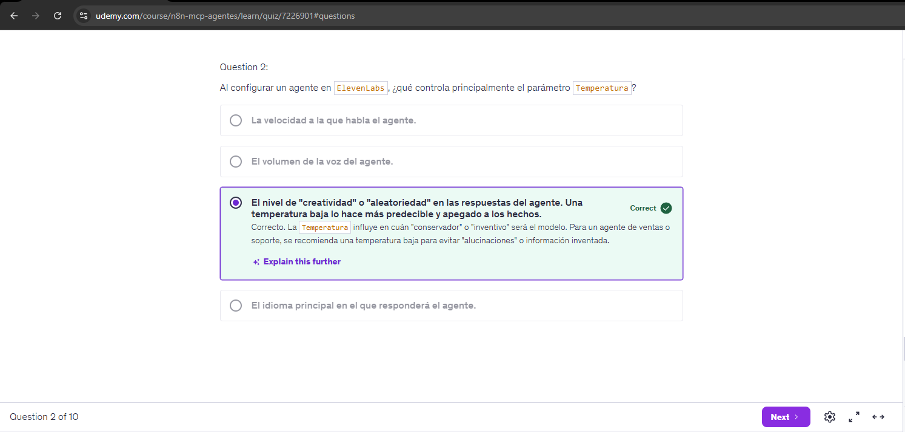
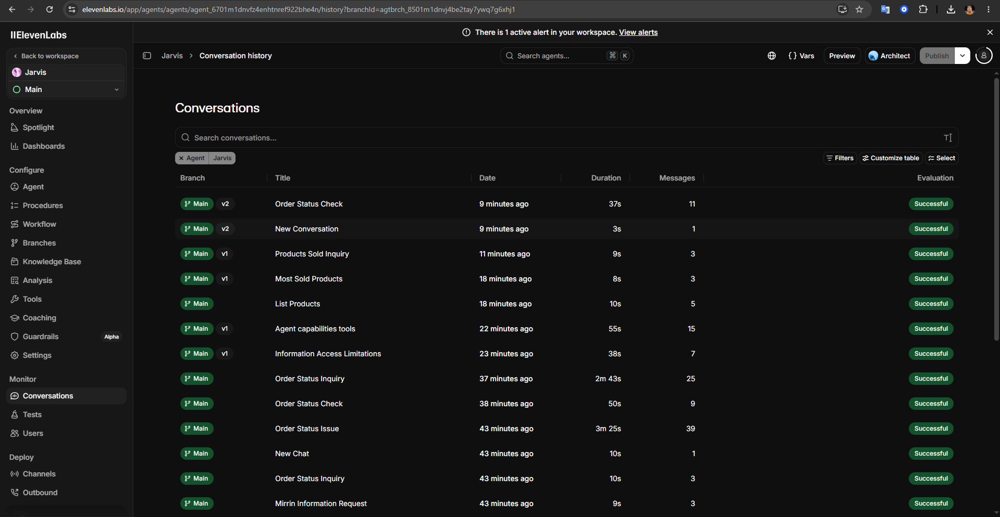
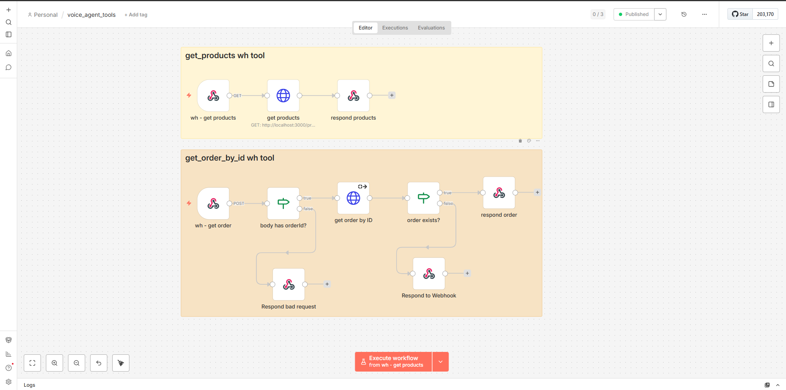

# Voice Agent

This project demonstrates how to build an AI-powered voice assistant capable of having natural conversations with users and retrieving dynamic information from a backend through **n8n Webhooks**.

The workflow combines **ElevenLabs, n8n, Webhooks, ngrok, and AI instructions** to create a voice agent that can provide product information and securely retrieve order information after validating the user's identity.

The main conversational and voice experience is handled by **ElevenLabs**, while n8n acts as the integration layer between the agent and the backend data.

## Overview

The project starts by creating an AI voice agent in **ElevenLabs** and assigning it a voice and a set of instructions that define how the assistant should behave.

Initially, a PDF containing product information was used as the agent's knowledge base. While this approach worked, it was not suitable for data that changes frequently.

To make the agent more dynamic, the workflow was redesigned to use **n8n Webhooks as external tools**. This allows the agent to request up-to-date information whenever a user asks about products or orders.

The final solution provides the agent with two tools:

* A tool for retrieving **product information**
* A tool for retrieving **order information**

The agent is also configured with security and validation rules. Before providing information about an order, the user must provide and verify both their **name and order ID**.

The agent is explicitly instructed to **never reveal email addresses or phone numbers**.

## Workflow

The workflow follows these main steps:

1. **Create the ElevenLabs Agent**

   An AI agent is created in ElevenLabs to handle the voice conversation with the user.

2. **Assign a Voice**

   A voice is selected and configured for the agent, providing the conversational interface through speech.

3. **Configure the Agent Instructions**

   The system instructions define how the agent should behave, what information it can provide, and how it should handle sensitive information.

4. **Initial Knowledge Base Testing**

   A PDF containing the available product information was initially added as a knowledge base.

   This allowed the agent to answer product-related questions, but the approach had an important limitation: the information was static and could become outdated whenever the underlying product data changed.

5. **Replace Static Knowledge with Dynamic Tools**

   To provide more up-to-date information, the static product knowledge base was replaced with external tools connected to n8n Webhooks.

   This allows the agent to retrieve information dynamically instead of relying exclusively on previously uploaded documents.

6. **Create the n8n Webhooks**

   Two Webhook endpoints are created in n8n:

   * **Product Information Webhook**
   * **Order Information Webhook**

   These endpoints expose the backend functionality required by the voice agent.

7. **Expose Local n8n to the Internet**

   Since the n8n instance is running locally, ElevenLabs cannot directly access the Webhook endpoints.

   **ngrok** is therefore used to create a public HTTPS tunnel to the local n8n instance.

8. **Connect the Webhooks as ElevenLabs Tools**

   The public Webhook URLs generated through ngrok are configured as tools in the ElevenLabs agent.

   The agent can now decide when it needs to call a tool based on the user's request.

9. **Retrieve Product Information**

   When a user asks about a product, the agent can call the product Webhook and retrieve the relevant information from the backend.

10. **Validate Order Requests**

    When a user requests information about an order, the agent must first request the user's **name and order ID**.

    The order information is only provided after both pieces of information have been successfully verified.

11. **Apply Information Security Rules**

    The agent's system instructions explicitly prevent it from revealing sensitive contact information such as:

    * Email addresses
    * Phone numbers

    These restrictions apply even when the information may be available in the backend response.

12. **Create the Landing Page**

    As the final step, a landing page is created to provide a user-facing interface for the voice assistant.

    The ElevenLabs voice chat component is embedded directly into the page, allowing users to interact with the agent through their browser.

## Topics

This project demonstrates how to build a voice-based AI assistant capable of interacting with external tools and dynamic backend data.

### Topics covered

* **ElevenLabs Agents**
* **AI voice assistants**
* **Voice configuration**
* **System instructions and AI behavior**
* **n8n Webhooks**
* **External tools**
* **Dynamic backend data**
* **ngrok**
* **Connecting local services to external platforms**
* **Order verification**
* **Data validation**
* **Sensitive information handling**
* **AI security instructions**
* **Embedding a voice assistant into a web page**
* **Production considerations for AI agents**

## Architecture

At a high level, the system can be summarized as:

**User → Landing Page → ElevenLabs Voice Agent → n8n Webhook → Backend / Data → ElevenLabs Agent → User**

The ElevenLabs agent acts as the **conversation and voice layer**, while n8n provides the **integration and tool layer**.

The agent has access to two main tools:

**Product Requests**

**ElevenLabs Agent → Product Webhook → Backend Data → Agent → User**

**Order Requests**

**ElevenLabs Agent → Name + Order ID Validation → Order Webhook → Backend Data → Agent → User**

The order flow contains an additional validation step to prevent unauthorized access to order information.

## Why Use n8n Webhooks?

The initial implementation relied on a PDF knowledge base containing product information.

While this approach is useful for relatively static information, it becomes problematic when the underlying data changes frequently. Updating the PDF every time product information changes would make the system difficult to maintain.

Using n8n Webhooks provides a more dynamic architecture.

Instead of storing all product and order information inside the agent's knowledge base, the agent can request the latest information from the backend when needed.

This approach provides several advantages:

* **Dynamic information**
* **Easier data maintenance**
* **Separation between the AI layer and backend**
* **Reusable backend endpoints**
* **More control over sensitive information**
* **Reduced dependency on static knowledge files**

## Why ngrok?

ElevenLabs requires externally accessible endpoints to communicate with the configured tools.

During development, n8n is running locally and its Webhook URLs are therefore not directly accessible from the public internet.

**ngrok** solves this problem by creating a secure public tunnel to the local n8n instance.

The development flow becomes:

**Local n8n → ngrok Tunnel → Public HTTPS URL → ElevenLabs Tool**

This makes it possible to develop and test the complete integration locally without deploying the n8n instance to a public server.

For production environments, the local ngrok setup should typically be replaced by a properly hosted and secured backend or n8n instance.

## Order Verification & Security

Order information requires additional validation because it may contain private customer or purchase information.

The agent is therefore instructed to follow a specific verification flow.

### Order Information Flow

1. The user requests information about an order.
2. The agent asks for the user's **name**.
3. The agent asks for the **order ID**.
4. The provided information is sent to the order verification workflow.
5. The backend validates the information.
6. Only after successful validation can the agent provide order information.

The agent also contains explicit instructions preventing it from exposing customer contact information.

### Restricted Information

The agent must never disclose:

* Customer email addresses
* Customer phone numbers

These restrictions are enforced through the agent's system instructions and should also be reinforced at the backend level in a production implementation.

AI instructions should not be considered the only security boundary. Sensitive data should ideally be filtered and protected before it reaches the model.

## Production Considerations

The current implementation uses **ngrok** to expose the local n8n environment during development and testing.

For a production deployment, the architecture should be further secured by considering:

* Hosting n8n or the backend in a production environment
* Using authentication for Webhook endpoints
* Validating and sanitizing incoming requests
* Implementing server-side authorization
* Limiting the information returned to the AI agent
* Avoiding sensitive data in model responses
* Monitoring tool usage and failed verification attempts
* Implementing rate limiting
* Rotating API keys and credentials regularly

The most important principle is that **security should be enforced by the backend, not only by the AI agent's instructions**.

## Output

The final result is a web-based AI voice assistant that can interact naturally with users and access dynamic backend information through external tools.

The agent can:

* Answer questions about available products
* Retrieve dynamic product information
* Handle order-related requests
* Validate a user's name and order ID before returning order information
* Avoid revealing email addresses and phone numbers
* Use n8n as an integration layer for backend operations
* Operate through a voice interface embedded in a landing page

This project demonstrates how **voice AI, workflow automation, external tools, and backend data** can be combined to create a more dynamic and secure conversational application.

## Screenshots

---

---

---

---

---

---

---

---

---

---

---

[Watch the Voice Agent video](./screenshots/video_20260902_193532.mp4)