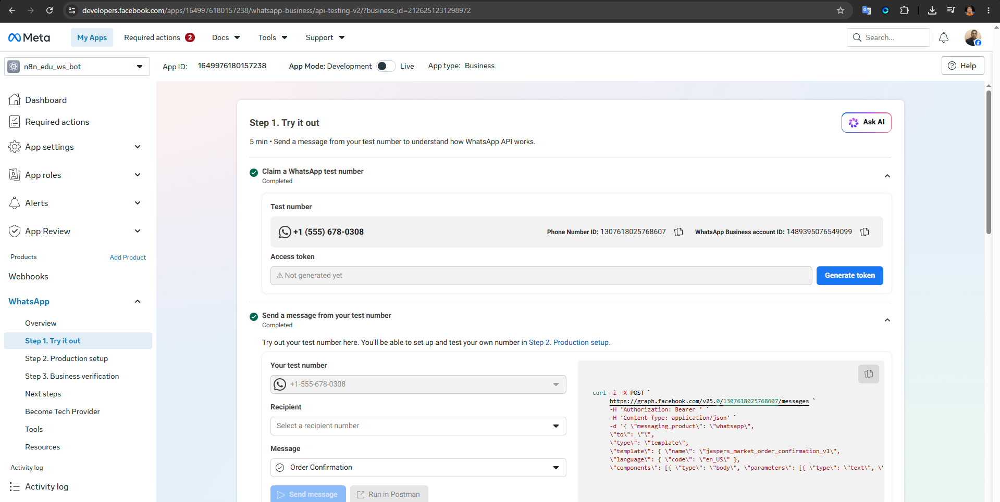
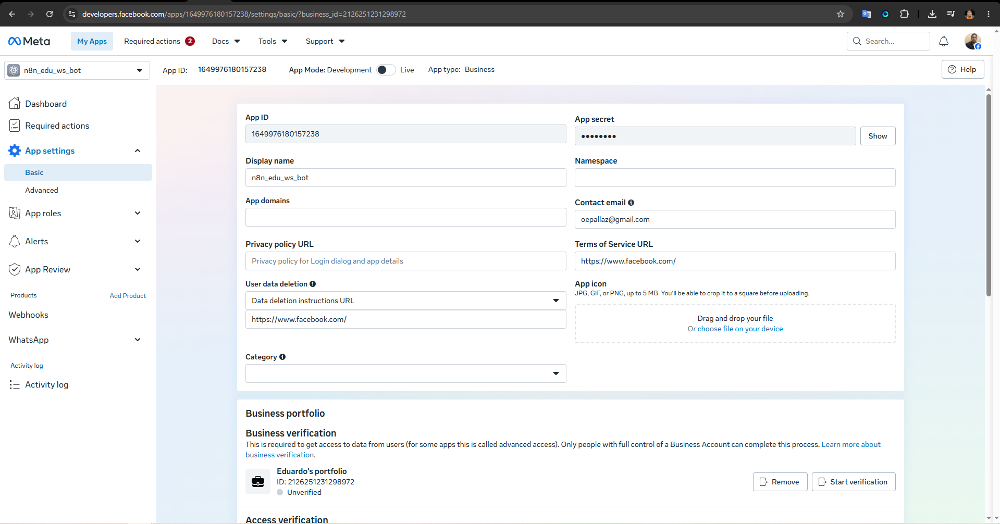
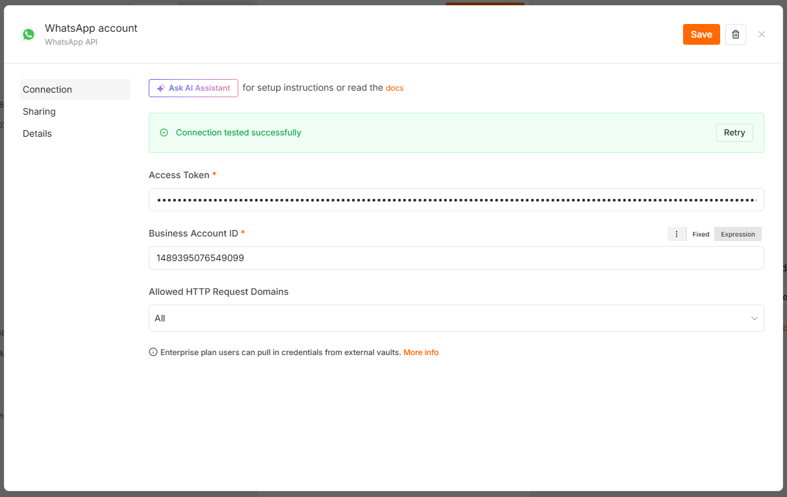
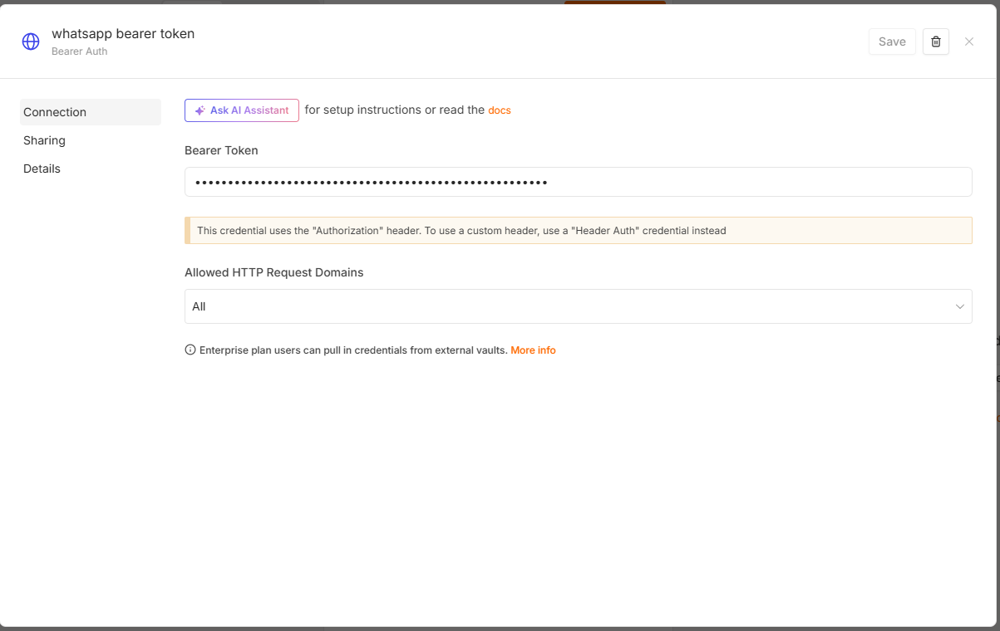
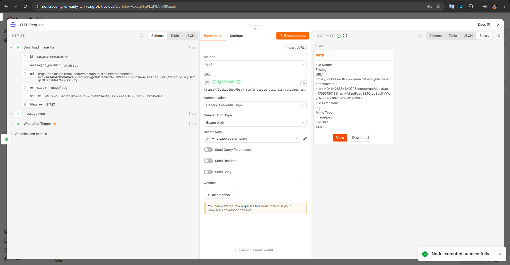
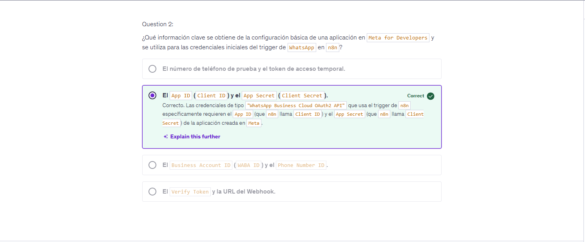
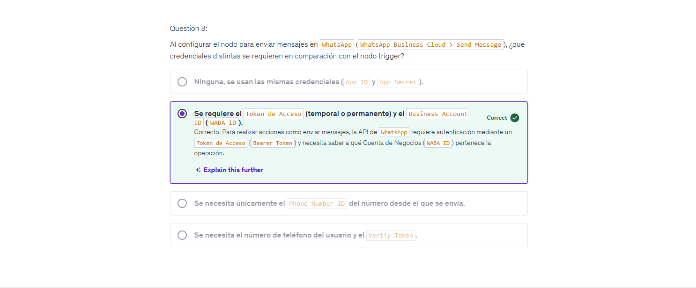
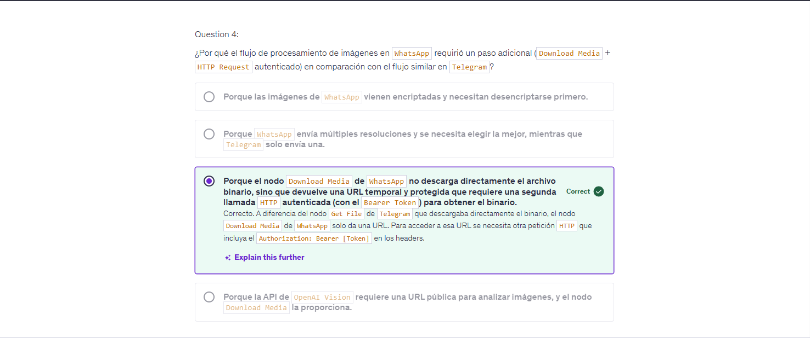
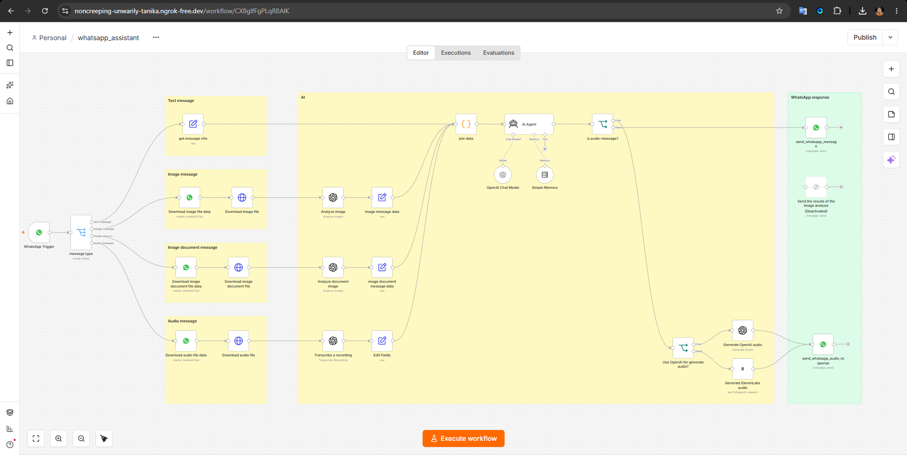
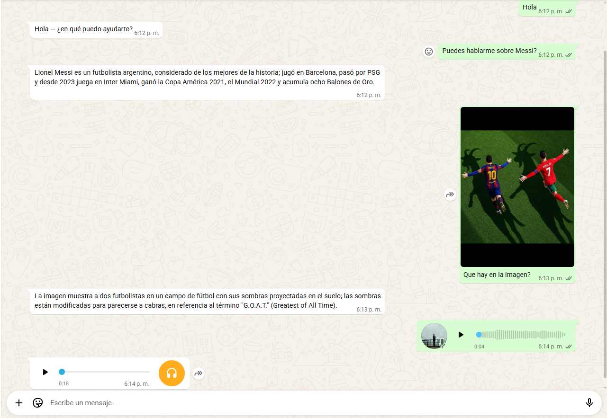

# WhatsApp Assistant Workflow

The workflow created here implements a **WhatsApp chatbot** capable of processing text, images, image documents, and audio messages.

## Setup

Because WhatsApp triggers cannot be tested locally without a publicly accessible webhook, it was necessary to run **n8n through Docker**. The Docker Compose file is located in this directory.

The required environment variables must be configured in the `.env` file. These variables use the domain provided by [ngrok](https://ngrok.com/).

Then run:

```bash
docker compose up -d
```

### WhatsApp Cloud API Setup

First, create an application through the [Meta for Developers](https://developers.facebook.com/) platform.

Then:

1. Add the **WhatsApp** product to the application.
2. Follow the setup instructions until Meta provides a **test phone number** and its corresponding **access token**.
3. Use this access token to configure the WhatsApp credentials in n8n.
4. The access token is temporary and expires after approximately one day. During development, a new token may therefore need to be generated regularly.
5. The same access token is required as a **Bearer token** when making HTTP requests to download files received through WhatsApp.

## Bot Interactions

The bot supports four types of interactions:

### 1. Text Message

When the user sends a text message:

* The workflow passes the message to an **OpenAI agent**.
* The agent generates a response.
* The response is sent back to the user as a text message through WhatsApp.

### 2. Image Message

When the user sends an image:

* The workflow retrieves the image information from WhatsApp.
* The response contains a URL that can be used to download the image.
* The image is downloaded using an HTTP request.
* A **Bearer token** containing the temporary access token obtained from the Meta application is required to download the file.
* The image is sent to OpenAI for analysis.
* If the user included a caption, the caption is used as the user prompt sent to OpenAI.
* Otherwise, a default prompt is used to ask OpenAI to describe the contents of the image.
* The analysis result is sent back to the user as a text message through WhatsApp.

### 3. Image Document Message

This interaction follows a similar process to the previous one, but applies when the user sends an image as a **file/document** instead of a regular image message.

The workflow identifies these messages by checking whether the MIME type contains:

```text
image/
```

Once identified as an image document, the workflow downloads and processes the image using the same OpenAI image-analysis process described above.

### 4. Audio Message

When the user sends an audio message:

* The workflow retrieves the audio file information from WhatsApp.
* The response contains a URL that can be used to download the audio file.
* The audio file is downloaded using an HTTP request.
* A **Bearer token** containing the temporary access token obtained from the Meta application is required to download the file.
* OpenAI is used to transcribe the audio.
* The transcription is passed to the AI agent.
* The agent generates a response based on the user's request.
* Since the original message was an audio message, the workflow responds with audio as well.
* OpenAI's audio generation node is used to convert the agent's response into speech.
* The generated audio is sent back to the user through WhatsApp.

Additionally, the workflow provides the option to generate audio using **ElevenLabs**. This requires:

* Available credits in the ElevenLabs account.
* An ElevenLabs API key.
* An ElevenLabs credential configured in n8n.

ElevenLabs provides a wider selection of voices and more realistic voice generation.

## Topics

This section covers the development of a **multimodal WhatsApp bot** capable of processing audio, text, and images through an AI agent.

Specifically, we will cover:

* WhatsApp Bots
* Sending Text
* Recording and Processing Audio
* Processing and Analyzing Images
* Responding in Different Formats
* Connecting WhatsApp to a Local Environment (`localhost`)
* ngrok

## Screenshots

---


---



---



---



---



---



---



---



---



---


---

[Watch the WhatsApp Assistant demo video](https://drive.google.com/file/d/1uuR1N4FrhvfOEjo0BTEWgMo0fvNuKcS8/view?usp=sharing)

## WhatsApp Trigger Issue

If the WhatsApp trigger does not work correctly, make a `POST` request to:

```text
https://graph.facebook.com/v25.0/<WABA_ID>/subscribed_apps
```

Use the following header:

```text
Key: Authorization
Value: Bearer TEST_NUMBER_ACCESS_TOKEN
```

Where:

* `WABA_ID` = WhatsApp Business Account ID
* `TEST_NUMBER_ACCESS_TOKEN` = Temporary access token associated with the WhatsApp test number

### Reference

[Watch the WhatsApp Trigger configuration video](https://www.youtube.com/watch?v=4CCT4OUW6Ac&t=495s)

---
