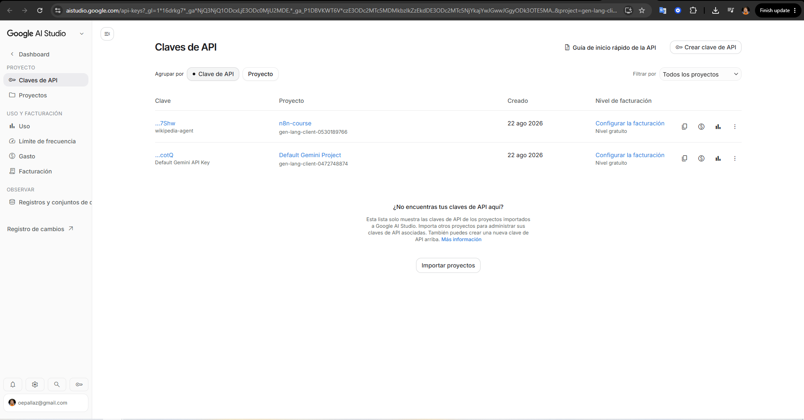
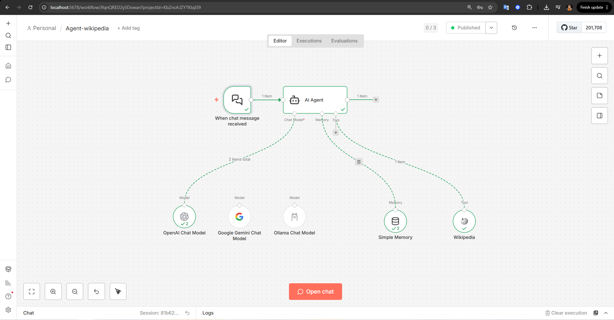
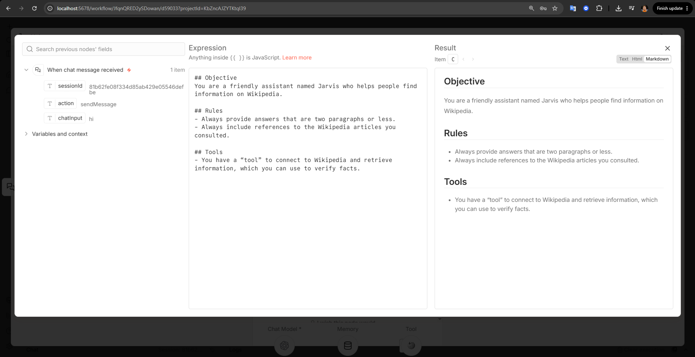
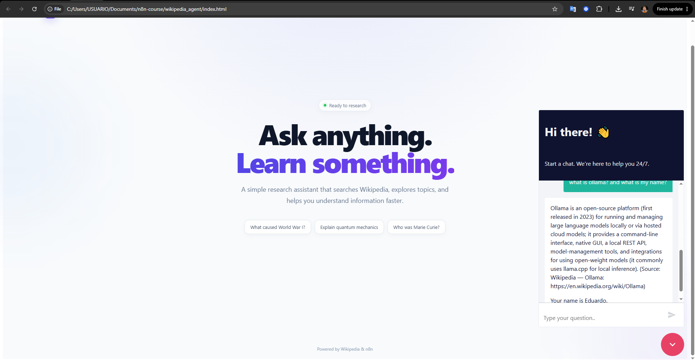

# Wikipedia Agent Workflow

This n8n workflow demonstrates how to build an AI-powered chatbot using the **AI Agent** node and external tools.

The chatbot can answer questions using an AI model and can access **Wikipedia** as an external information source when additional context is needed. The workflow also explores different AI models, memory options, and ways to embed the chatbot into a web application.

## Overview

The workflow starts with an **n8n Chatbot** interface that provides a simple way for users to interact with the AI agent.

The chatbot can be accessed through a dedicated URL or embedded directly into another web application as a **chat widget**, as demonstrated in this workflow.

An **AI Agent** is then connected to the chatbot, giving it the ability to process user messages, reason about the request, and generate appropriate responses.

## AI Models

The AI Agent requires a language model to generate responses.

During the development of this workflow, several model providers were explored:

* **OpenAI models**
* **Google Gemini models**
* **Local models through Ollama**

Local models using Ollama could not be fully tested because of the hardware limitations of the development environment. Running local language models typically requires significantly more computational resources, particularly RAM and GPU capacity.

The workflow can nevertheless be configured to use Ollama when suitable local hardware is available.

## Memory

The AI Agent can also use memory to maintain context across messages.

For this workflow, **Simple Memory** was used because it is quick and easy to configure.

However, n8n also allows the agent's memory to be connected to external databases, making it possible to implement more persistent and scalable conversation history. Examples include:

* PostgreSQL
* DynamoDB

Using an external database can be particularly useful when conversations need to persist beyond a single session or when the chatbot needs to support a larger number of users.

## Wikipedia Tool

The workflow also demonstrates how an AI Agent can use external tools.

**Wikipedia** was connected as a tool that the agent can invoke when it needs additional information to answer a user's question.

Instead of relying exclusively on the language model's built-in knowledge, the agent can query Wikipedia, retrieve relevant information, and use the results as context for its response.

This introduces an important concept in AI agent workflows: **giving an AI model access to external tools and data sources**.

## Topics

This workflow introduces the fundamentals of building AI agents and AI-powered chatbots with n8n.

### Topics covered

* **AI Agent node**
* **OpenAI models**
* **Google Gemini models**
* **Local AI models with Ollama**
* **Chatbot interfaces**
* **Chatbot styling and customization**
* **Chatbot widgets**
* **AI Agent memory**
* **External tools**
* **Wikipedia integration**
* **Embedding an n8n chatbot into a web application**

## Architecture

At a high level, the workflow can be summarized as:

**n8n Chatbot → AI Agent → Language Model + Memory + Wikipedia Tool → Response**

The user interacts with the chatbot, while the AI Agent coordinates the language model, conversation memory, and external tools required to generate the response.

## Key Takeaway

This workflow provides an introduction to building **tool-enabled AI agents** with n8n.

Rather than creating a chatbot that only generates responses from a language model, the workflow demonstrates how an agent can be equipped with **memory and external tools**, allowing it to retrieve additional information and maintain conversational context.

It also demonstrates how the same chatbot can be exposed through a URL or embedded directly into an existing web application.

## Screenshots

---

---

---

