# Workflow Authentication

This n8n workflow demonstrates how to implement and test different authentication methods.

The workflow uses a simple webhook endpoint that returns mock data, allowing each authentication mechanism to be tested independently. The requested ID is also extracted from the URL and included in the response.

## Overview

The workflow starts with a **Webhook** node that serves as a test endpoint for experimenting with different authentication methods.

The endpoint accepts requests containing an ID as part of the URL and responds with mock data. This provides a simple environment for understanding how authentication works and how information can be extracted from incoming HTTP requests.

The workflow focuses on three common authentication approaches:

* Header authentication
* Basic authentication
* JWT (JSON Web Token) authentication

## Authentication Methods

### Header Authentication

The workflow demonstrates how to protect a webhook using authentication information provided through HTTP headers.

This approach is commonly used with API keys or other custom authentication tokens.

The exercise also covers how to access and process header information received by the webhook.

### Basic Authentication

The workflow demonstrates **Basic Authentication**, where the client provides a username and password as part of the HTTP request.

This provides an opportunity to understand how credentials are configured and validated when accessing an n8n webhook.

### JWT Authentication

The workflow also introduces **JSON Web Tokens (JWTs)** as an authentication mechanism.

JWTs are commonly used for stateless authentication between applications and APIs. The workflow demonstrates how a token can be provided with a request and how the information contained in the request can be accessed and processed.

## Request Data

In addition to authentication, the workflow demonstrates how to extract information from incoming webhook requests.

The exercises cover working with:

* HTTP headers
* Request parameters
* URL path segments
* Query arguments
* Authentication credentials

For example, an ID included in the webhook URL can be extracted and used in the workflow response.

## Mock Response

After processing the request, the webhook returns mock data along with the ID received from the URL.

This keeps the workflow intentionally simple so that the focus remains on understanding **authentication and request handling**, rather than implementing a complete business process.

## Topics

The goal of this section is to learn how to work with different authentication mechanisms when exposing n8n workflows as HTTP endpoints.

### Topics covered

* **Webhook authentication**
* **Header authentication**
* **Basic Authentication**
* **JWT authentication**
* **HTTP request headers**
* **URL path parameters**
* **Query parameters**
* **Extracting data from incoming requests**
* **Testing authenticated API endpoints**
* **Returning data from webhook workflows**

## Key Takeaway

This workflow provides a practical introduction to securing n8n webhook endpoints and working with data received through HTTP requests.

By testing multiple authentication methods against the same basic webhook, it becomes easier to understand the differences between each approach and how authentication data can be accessed inside an n8n workflow.

## Screenshots

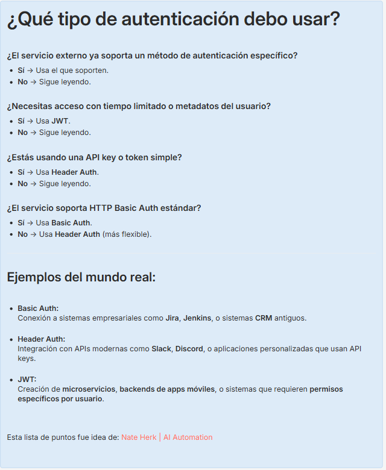

---
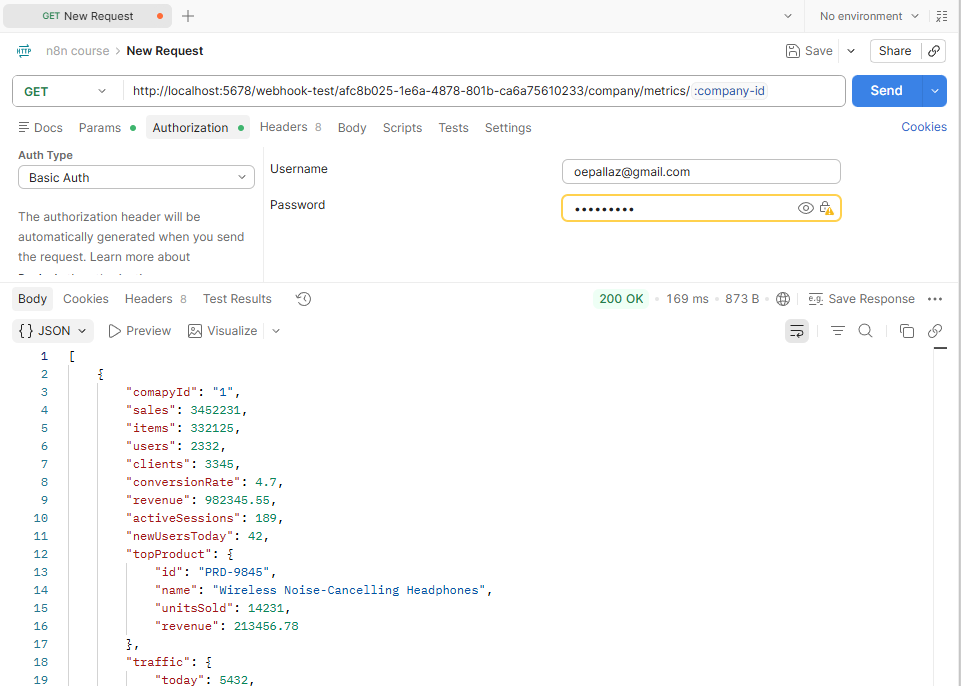

---

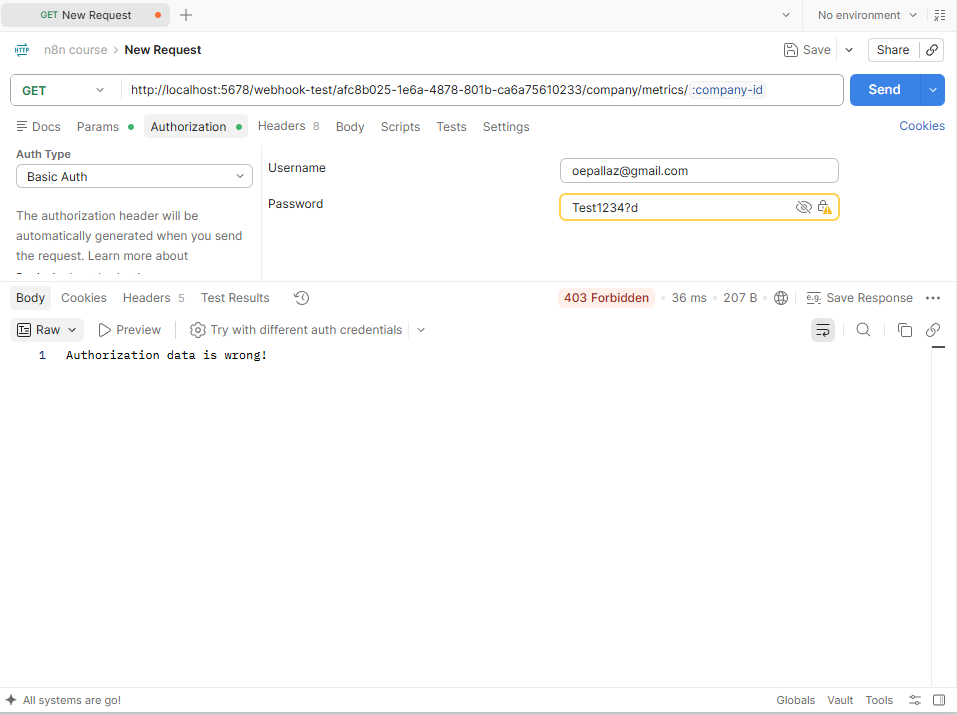

---

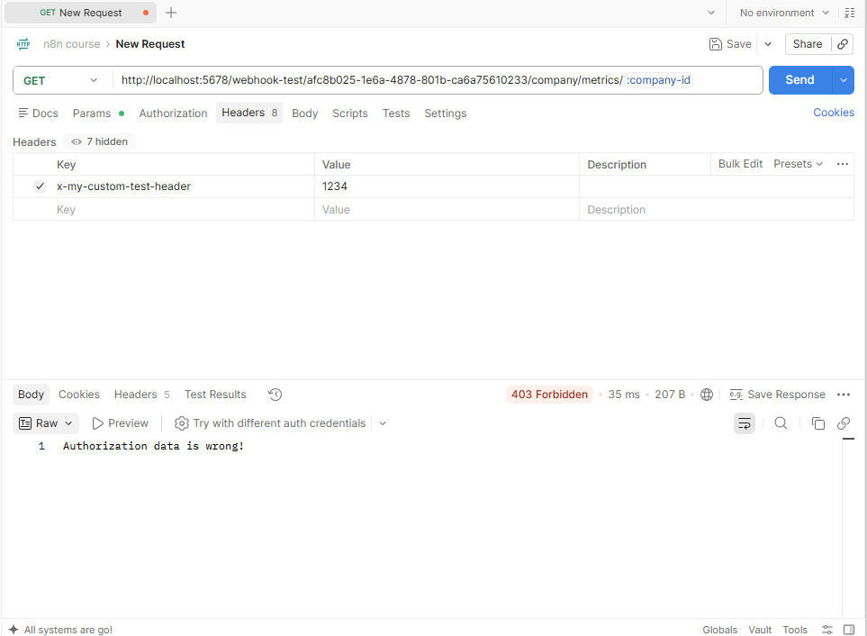

---

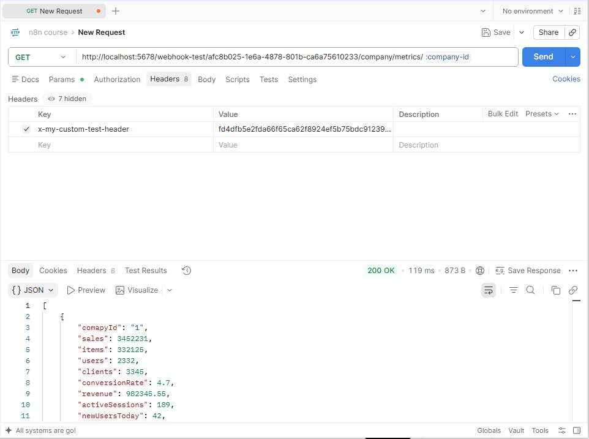

---

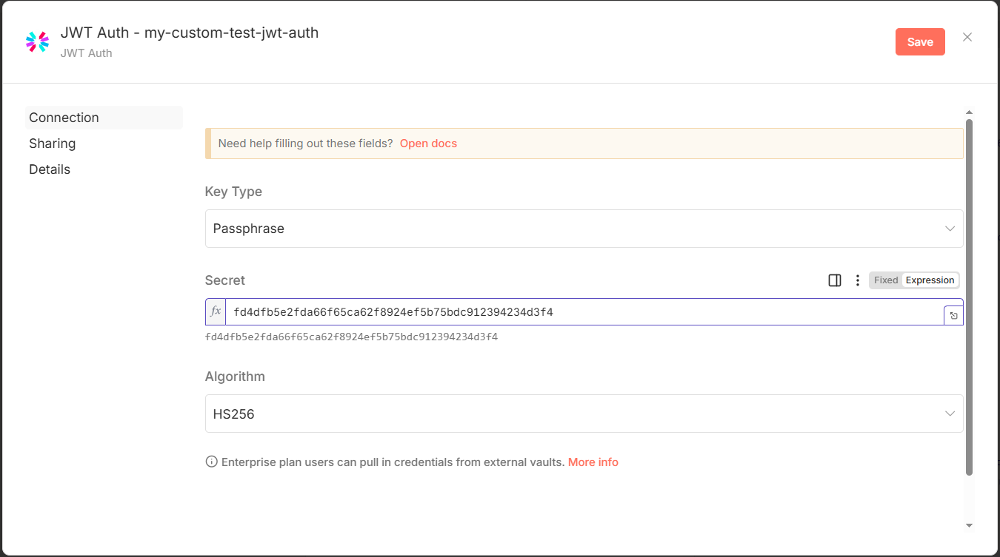

---

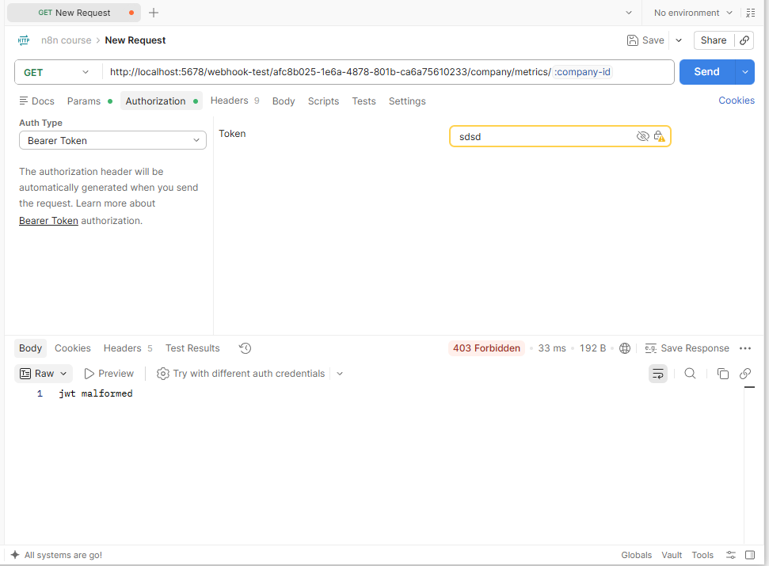

---

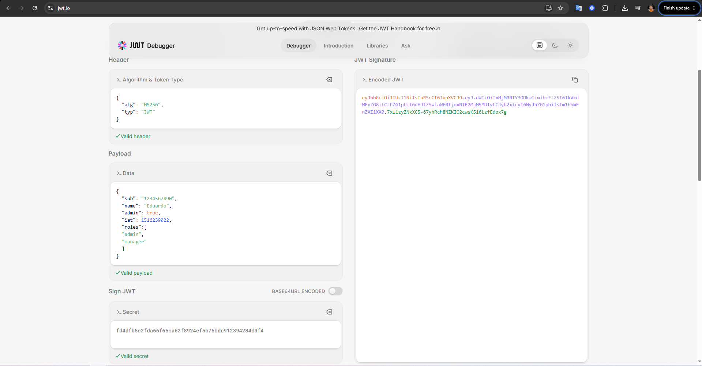

---

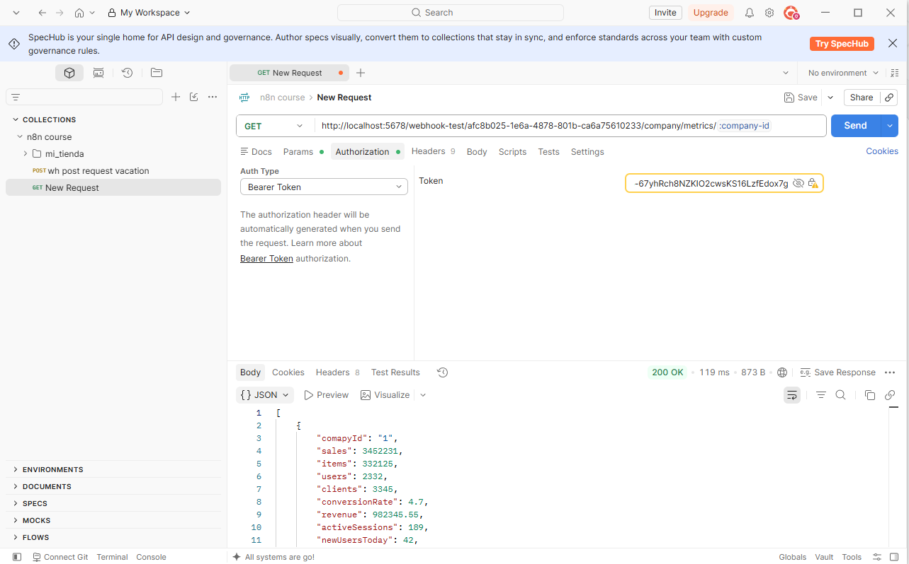

---

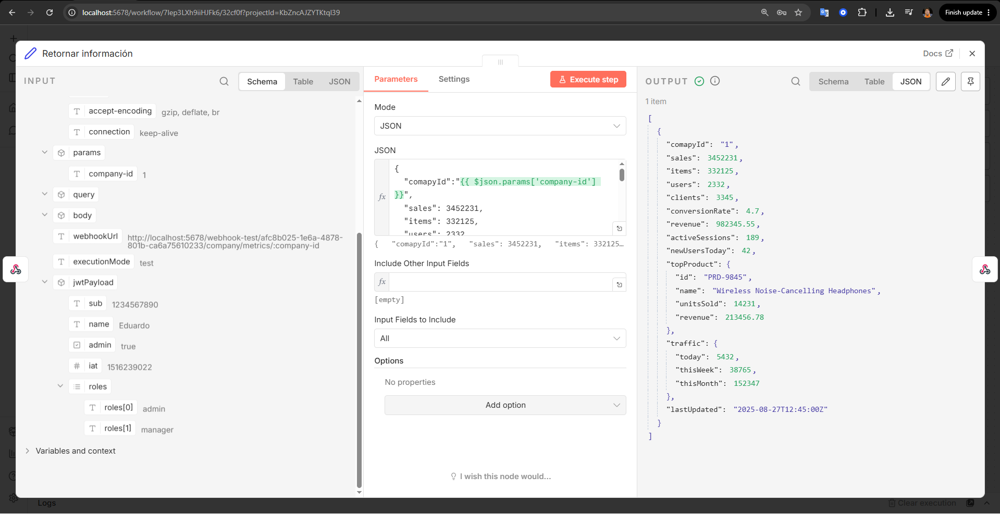

---

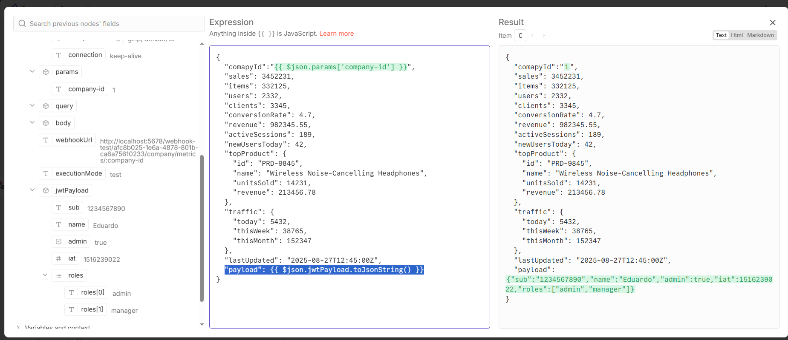

---

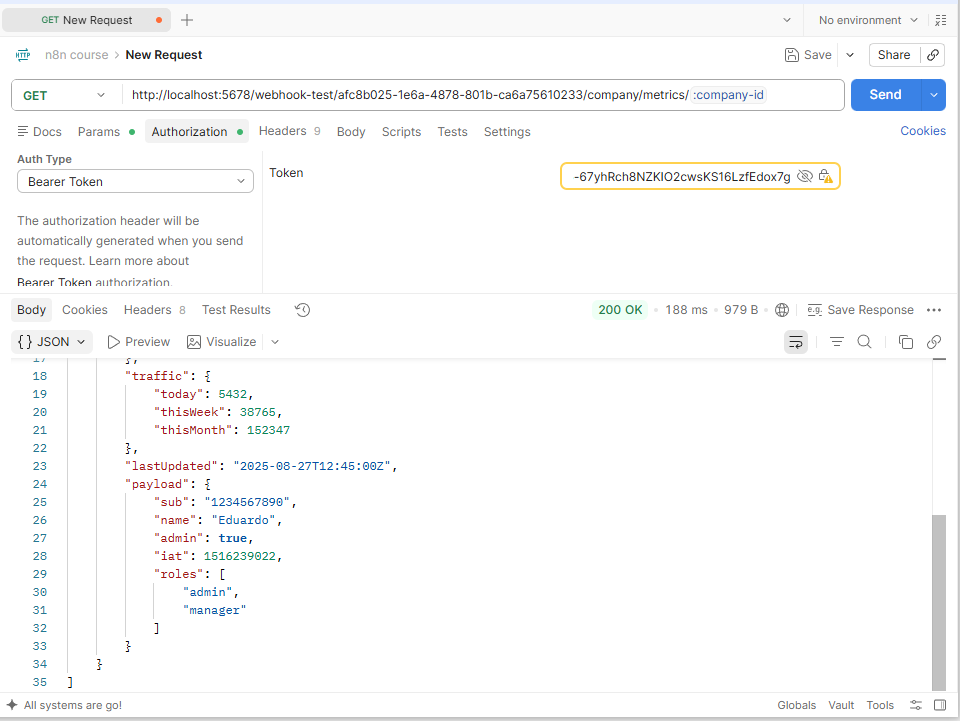

---

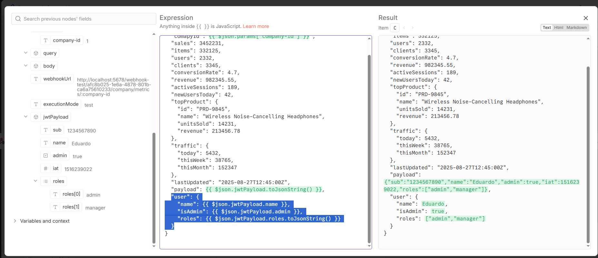

---

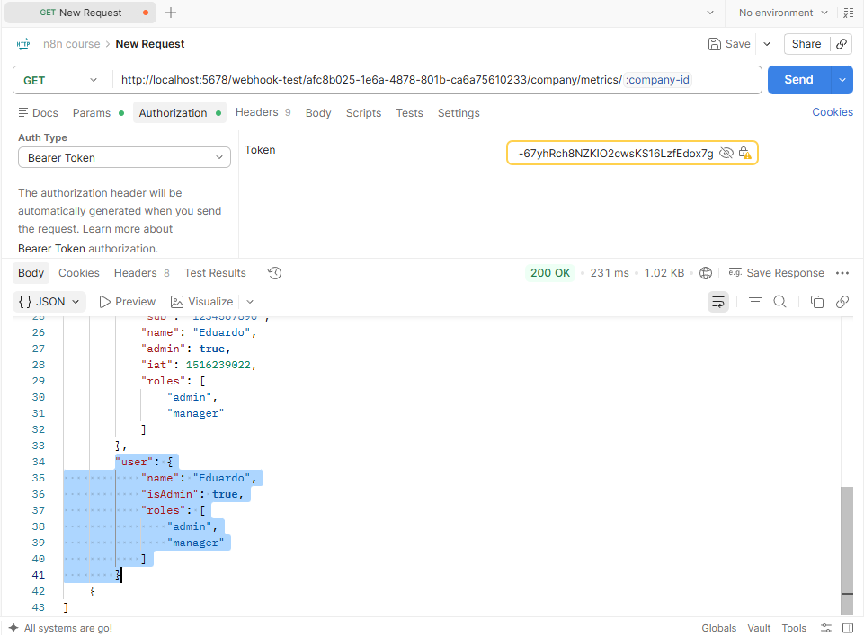

---

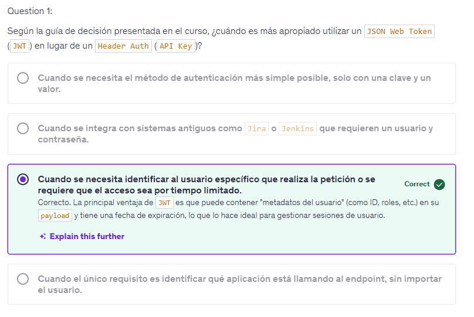

---

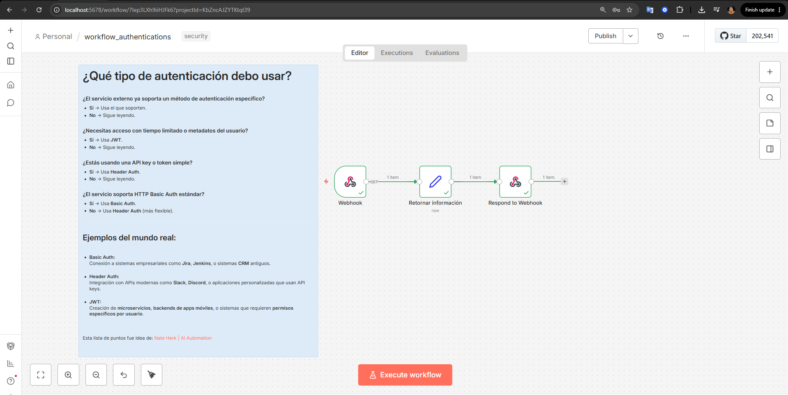
